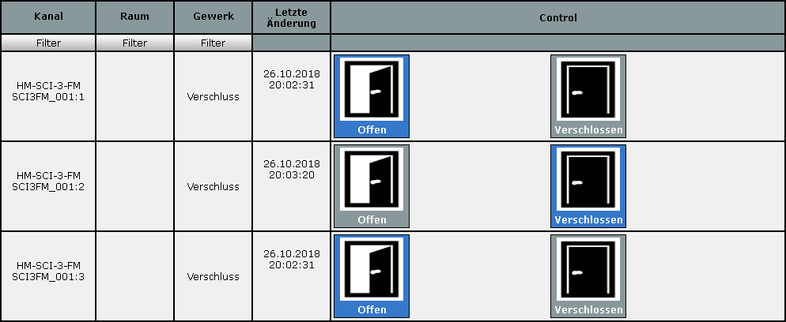

# 3-Kanal Kontakt-Interface für Öffner und Schließerkontake (HB-SCI-3-FM)

- von 'Position' abgeleitete Klasse 'OnePinPosition' für das Einlesen der Schließerkontakte
- für die 3 Eingänge werden im Sketch pull-up Widerstände konfiguriert
- Das Gerät HB-SCI-3-FM wird durch die Zentrale standardmäßig direkt beim Anlernen auf "gesicherte Übertragung" eingestellt. Damit dieser Eigenbau funktioniert müssen **alle 3 Kanäle** nach dem Anlernen auf "Standard Übertragung" umgestellt werden. Oder man aktiviert AES für den Sketch:
[AskSinPP AES Support](https://github.com/pa-pa/AskSinPP#enable-aes-support)

## Schaltung

- nur ein normales AskSinPP Gerät (z.B. Arduino Pro Mini + CC1101 + LED + Config Taster)
- einfach 3 freie Pins für die Schließerkontakte verwenden

## Das angemeldete Gerät im RaspberryMatic WebUI

## Benötige Libraries

[AskSinPP Library](https://github.com/pa-pa/AskSinPP) 
[EnableInterrupt](https://github.com/GreyGnome/EnableInterrupt) 
[Low-Power](https://github.com/rocketscream/Low-Power)

## Lizenz

**Creative Commons BY-NC-SA** 
Give Credit, NonCommercial, ShareAlike

 This work is licensed under a <a rel="license" href="http://creativecommons.org/licenses/by-nc-sa/4.0/">Creative Commons Attribution-NonCommercial-ShareAlike 4.0 International License</a>.
