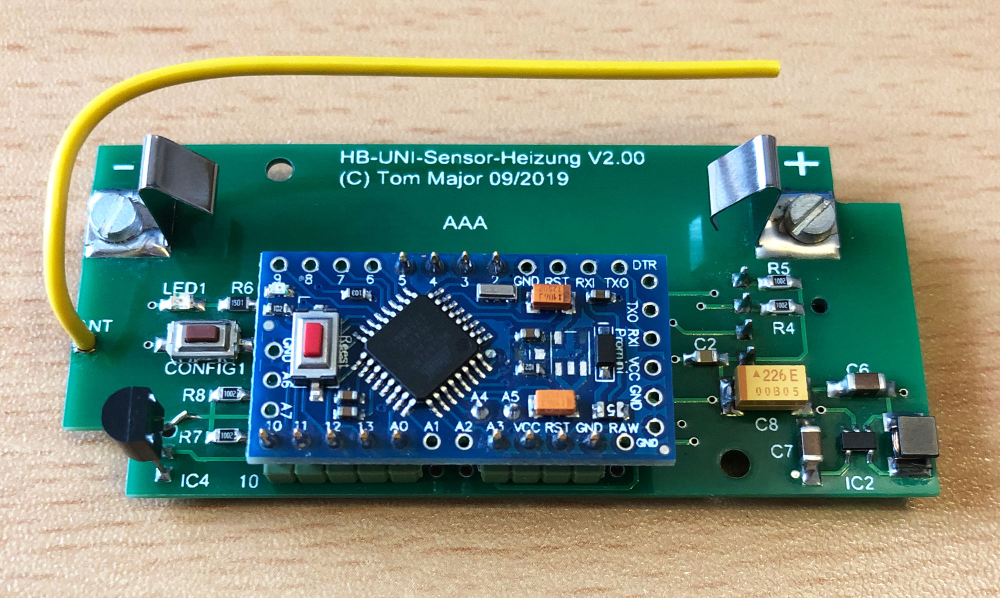
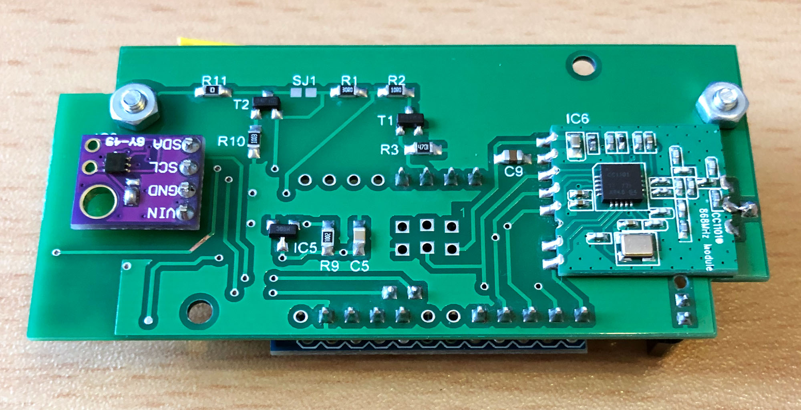
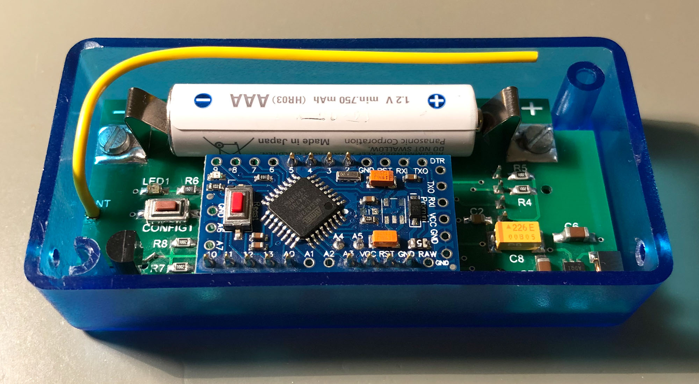
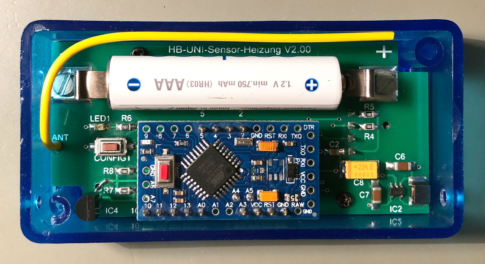
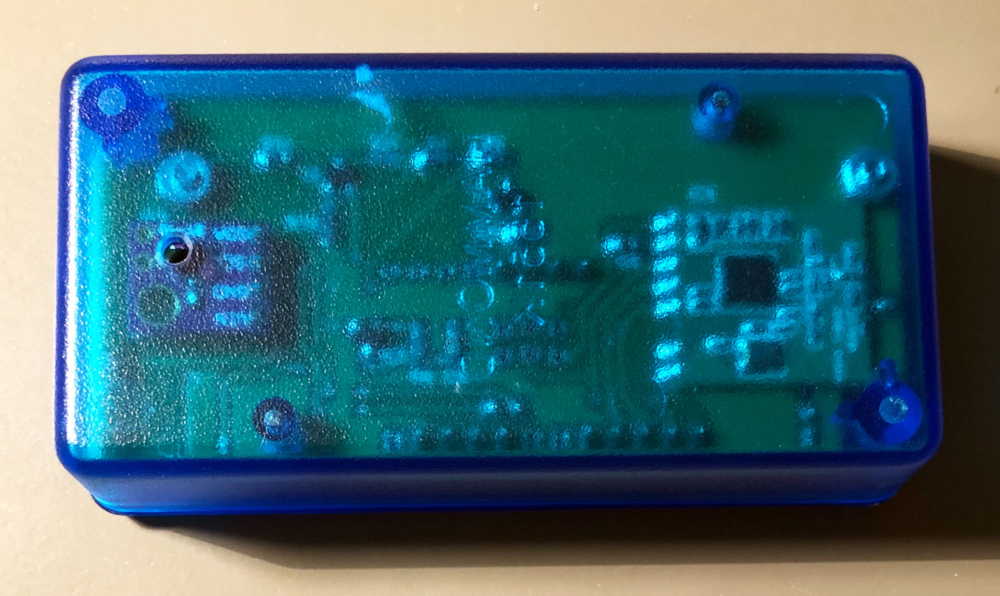
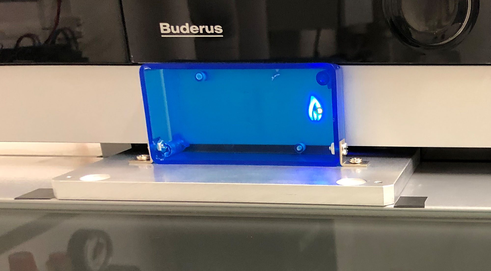
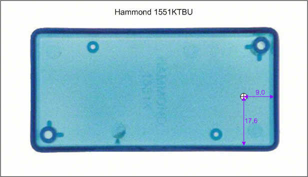
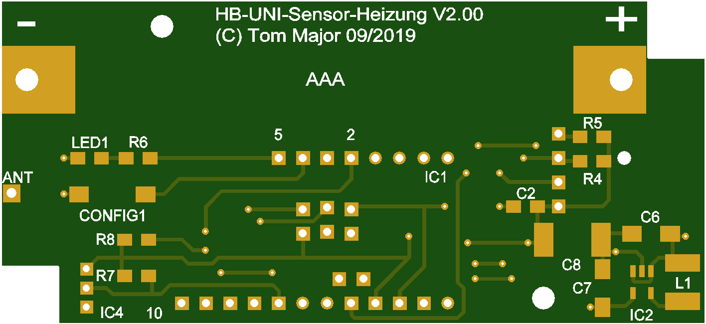
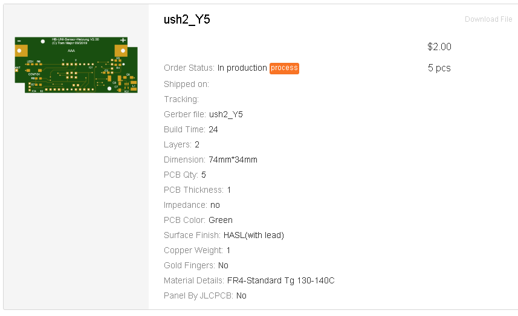

# HomeMatic Sensor/Schwellwertschalter - HB-UNI-Sensor-Heizung

- Der HB-UNI-Sensor-Heizung ist ein vom Universalsensor [HB-UNI-Sensor1](https://github.com/TomMajor/SmartHome/tree/master/HB-UNI-Sensor1) abgeleitetes Gerät.
- Es ist ein Schwellwertschalter, der bei Unter- und Überschreitung eines bestimmten Sensorwertes möglichst zeitnah ein Telegramm an die Zentrale sendet.
- Die hier dargestellte Konfiguration ist für die kontaktlose Überwachung einer LED (Brenner), dabei wird die Helligkeit mittels eines MAX44009 gemessen.
- Natürlich sind auch andere Messwerte wie Temperatur oder Luftfeuchtigkeit zur Auslösung bei einem bestimmten Schwellwert möglich.
- Das Gerät wacht aller 60 Sek. kurz auf, misst die Helligkeit und entscheidet anhand des Messwertes ob ein Telegramm an die Zentrale gesendet werden soll oder nicht.
- Der Status (An/Aus) wird dabei in HomeMatic auf den Geräte-Datenpunkt 'Digitaler Eingang / Ventilposition' gelegt (um das vorhandene AddOn nutzen zu können).
- Falls es in einer definierten Zeit (hier 4h) keine relevanten Änderungen des Meßwertes gibt wird trotzdem ein Telegramm gesendet (Alive-Status).
- Die Schaltung arbeitet mit einem NiMH 1,2V Akku und integriertem Step-Up Wandler MAX1724. 
  Ohne den Step-Up Wandler kann sie AskSinPP typisch mit 3V betrieben werden.
- Es wurde eine Platine entwickelt die einen Arduino Pro Mini 8MHz benutzt (bei dem die Maßnahmen zur [Ruhestromverringerung](https://github.com/TomMajor/SmartHome/tree/master/Info/Ruhestrom) angewendet wurden) - da ich nicht immer Lust habe den AVR als TQFP32 zu löten :smiley_cat:

## Konfiguration

- Wie oft soll gemessen werden? 
`#define MEASURE_INTERVAL 54        // 60sec (Korrekturfaktor: 0,8928, siehe WDT_Frequenz.ino)`

- In welchem Intervall soll das Alive-Telegramm gesendet werden? 
`#define MAX_SEND_INTERVAL 12856    // 4h (14400sec, Korrekturfaktor: 0,8928), auch ohne Schwellwertänderung mindestens in diesem Intervall senden`

- Schwellwert bei dessen Unter- und Überschreitung ein Telegramm gesendet wird. 
`#define LIGHT_THRESHOLD 75         // Schwellwert Lux`

## Schaltung

[Schaltung](PCB/Files/HB-UNI-Sensor-Heizung_V2.pdf)

## Aufbau

## Platine / Gerberdateien

[PCB](PCB)

## Aufbau / Stückliste

- Die Platine wurde für das Gehäuse Hammond 1551K entwickelt.
- Bei der Bestellung auf **1mm Platinendicke** achten!

| Anzahl	| Name	    | Wert	            | Gehäuse       | Bemerkungen |
|---|---|---|---|---|
| 5 | R4, R5, R7, R8, R9 | 10k	            | 0805          | |
| 1 | R6	            | 1,5k	            | 0805          | |
| 1 | R11	            | 0	                | 0805          | |
| 2 | C2, C5	        | 100n	            | 0805          | |
| 2 | C6, C7	        | 10µ	            | 1206          | |
| 1 | C8	            | 22µ/16V           | ELKO_C        | Tantalelko Größe C |
| 1 | C9	            | 1µ	            | 0805          | |
| 1 | L1	            | 10u	            | SMD           | LQH43CN100K03L |
| 1 | LED1	            | gelb	            | 0805          | |
| 1 | CONFIG1	        | DTSM-3	        | SMD           | |
| 1 | BAT1	            | AAA	            | KEYSTONE 5230	| |
| 1 | IC1	            | Arduino Pro Mini  | -             | 3,3V / 8MHz Version |
| 1 | IC2	            | MAX1724EZK30	    | SOT23-5       | auch MAX1724EZK33 möglich |
| 1 | IC3	            | MAX44009_GY49	    | Breakout-Board| |
| 1 | IC6	            | CC1101	        | -             | |
|   |                   |                   |               | |
| 1 | R1	            | 30	            | 0805          | Optional (Batt.messung unter Last) |
| 1 | R2	            | 10	            | 0805          | Optional (Batt.messung unter Last) |
| 1 | R3	            | 4,7k	            | 0805          | Optional (Batt.messung unter Last) |
| 1 | T1	            | IRML6344          | SOT23-3       | Optional (Batt.messung unter Last) |
|   |                   |                   |               | |
| 1 | R10	            | 100k	            | 0805          | Optional (Verpolschutz) |
| 1 | T2	            | DMG3415U	        | SOT23-3       | Optional (Verpolschutz) |
|   |                   |                   |               | |
| 1 | IC4	            | DS18B20	        | TO92          | Optional (Temperaturmessung) |
|   |                   |                   |               | |
| 1 | IC5	            | MCP111T-270	    | SOT23-3       | Optional (BI-Protection) |

## Benötige Libraries

[AskSinPP Library](https://github.com/pa-pa/AskSinPP) 
[EnableInterrupt](https://github.com/GreyGnome/EnableInterrupt) 
[Low-Power](https://github.com/rocketscream/Low-Power)

Für einen DS18x20 Sensor (Temperatur): 
[OneWire](https://github.com/PaulStoffregen/OneWire)

Für einen MAX44009 Sensor (Helligkeit in Lux): 
keine zusätzliche Library nötig.

## Lizenz

**Creative Commons BY-NC-SA** 
Give Credit, NonCommercial, ShareAlike

 This work is licensed under a <a rel="license" href="http://creativecommons.org/licenses/by-nc-sa/4.0/">Creative Commons Attribution-NonCommercial-ShareAlike 4.0 International License</a>.
