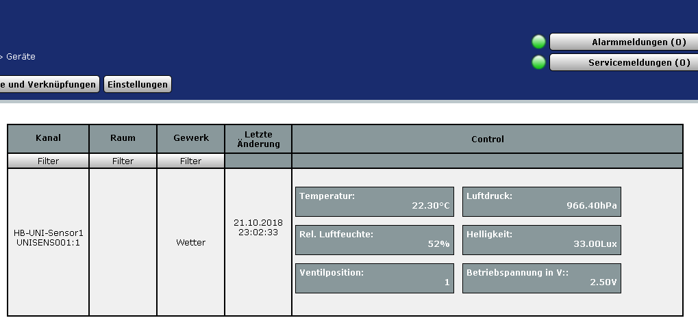
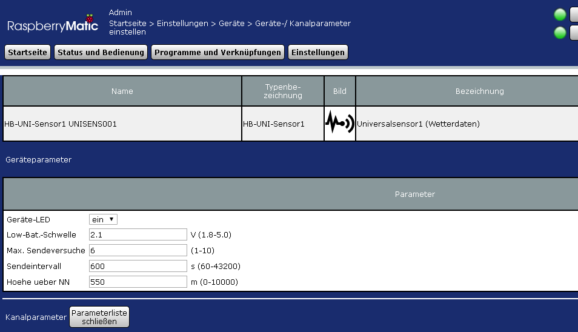
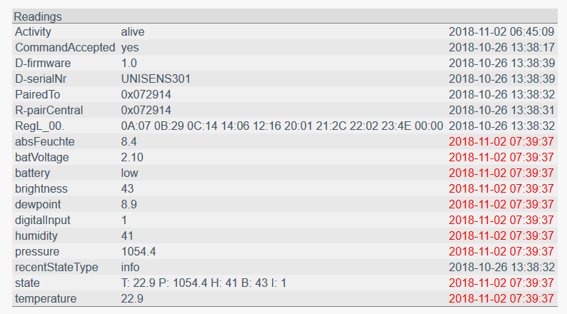

## Universalsensor (HB-UNI-Sensor1)

- Demonstriert einen HomeMatic/RaspberryMatic/FHEM Universalsensor für Temperatur, Luftdruck, Luftfeuchte, Helligkeit usw.
- modifizierbar für andere Sensoren
- konfigurierbares Sendeintervall über WebUI
- konfigurierbare Höhe (für Berechnung des Luftdrucks auf Meeresniveau/Normaldruck) über WebUI
- über die defines am Anfang des Sketches können entweder Dummy Werte für die Sensoren (zum Testen der Anbindung an HomeMatic/RaspberryMatic/FHEM) oder reale Sensoren aktiviert werden
Beispiel: 
`#define SENSOR_BME280    // realer BME280 angeschlossen` 
`//#define SENSOR_BME280    // es werden BME280 Dummy Werte gesendet`
- Es können mehrere HB-UNI-Sensor1 an einer Zentrale verwendet werden. Dafür müssen sich die einzelnen Sensoren nur in Device ID und Device Serial unterscheiden: 
`const struct DeviceInfo PROGMEM devinfo = ` 
`  { 0xA5, 0xA5, 0x00 },    // Device ID` 
`  "UNISENS001",            // Device Serial` 
- Ich empfehle den MAX44009 Helligkeitssensor anstatt dem TSL2561, siehe 
[SensorTest_Lux](https://github.com/TomMajor/AskSinPP_Examples/tree/master/Info/SensorTest_Lux)

# Benötige Libraries

[AskSinPP Library](https://github.com/pa-pa/AskSinPP) 
[EnableInterrupt](https://github.com/GreyGnome/EnableInterrupt) 
[Low-Power](https://github.com/rocketscream/Low-Power)

Für einen DS18x20 Sensor (Temperatur): 
[OneWire](https://github.com/PaulStoffregen/OneWire)

Für einen BME280 Sensor (Temperatur/Druck/Feuchte): 
[BME280](https://github.com/finitespace/BME280)

Für einen TSL2561 Sensor (Helligkeit in Lux): 
[TSL2561](https://github.com/adafruit/TSL2561-Arduino-Library)

Für einen MAX44009 Sensor (Helligkeit in Lux): 
keine zusätzliche Library nötig.

Für einen SHT10 Sensor (Feuchte): 
[SHT10](https://github.com/spease/Sensirion)

# Schaltung

# Messung der Batteriespannung

- Option1: Batteriespannungsmessung Standard (UBatt = Betriebsspannung AVR) 
keine zusätzliche Hardware notwendig 
`typedef AskSin<LedType, BatterySensor, RadioType> BaseHal;` 

- Option2: Batteriespannungsmessung für Step-Up 
2 zusätzliche Widerstände notwendig, Verwendung der Batterieklasse BatterySensorUni 
`BatterySensorUni<17,7,3000>` 
`// sense pin = A1 = 15, activation pin = D7 = 7, Vcc nominal 3,0V`

- Option3: Echte Batteriespannungsmessung unter Last 
Sie dient u.a. dem Schutz vor einem "Babbling Idiot, siehe
[Babbling Idiot Protection](https://github.com/TomMajor/AskSinPP_Examples/tree/master/Info/Babbling%20Idiot%20Protection)
  
Aus meiner Sicht würde es sehr helfen, eine echte Messung des Batteriezustands unter Last zu haben, um frühzeitig leere Batterien zu erkennen und zu tauschen. Bekanntermaßen sagt eine Spannungsmessung an unbelasteter Batterie, je nach Batterie- bzw. Akkutyp, nicht viel über den Ladezustand aus.
  
Die Schaltung belastet die Batterie bzw. den Akku für einige Hundert Millisekunden und misst dabei die Spannung.
Dies führt meiner Meinung nach zu realistischeren Werten über den Batteriezustand als eine asynchrone und unbelastete Messung.
  
Dazu wurde eine neue Batterieklasse nach Vorbild von papas Batterieklassen erstellt. Sie heißt hier BatterySensorLoad und befindet sich unter Sensors/BatterySensorLoad.h  
Mit dieser Klasse und der Schaltung wird der 1,2V Akku mit ca. 75mA für die kurze Zeit der Messung belastet. Anpassungen an andere Spannungen und Ströme sind natürlich leicht über die Widerstände R5/R6 möglich. Momentan geschieht das 2 mal am Tag. 
`TODO code für Dekl. der Klasse` 
`hal.battery.init(seconds2ticks(60UL*60*12), sysclock, 2000);` 
`// 2x Batt.messung täglich, Spannungsteiler 1:2` 

Das Bild zeigt den Einbruch der Batteriespannung wenn für 200ms mit 75mA belastet wird. Die Spannung bricht um 142mV ein und wird am Ende der 200ms gemessen.
 

# Prototyp

# CCU2/RaspberryMatic Installation
Einstellungen/Systemsteuerung/Zusatzsoftware -> Datei CCU_RM/HB-UNI-Sensor1-addon.tgz installieren.

# RaspberryMatic WebUI
Der angemeldete Sensor auf der RaspberryMatic:

# FHEM Installation
Die Datei FHEM/HMConfig_UniSensor1.pm nach /opt/fhem/FHEM kopieren, dann FHEM neustarten.

