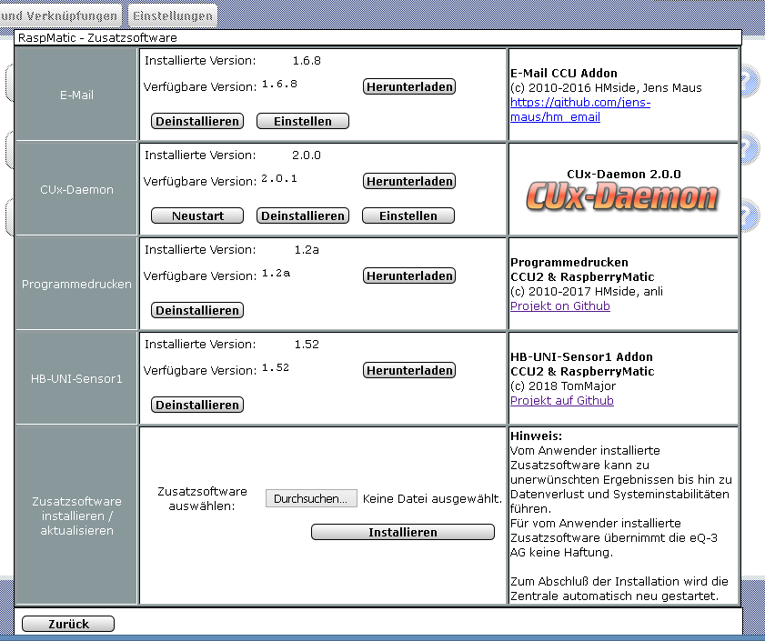

## Universalsensor (HB-UNI-Sensor1)

- Demonstriert einen HomeMatic/RaspberryMatic/FHEM Universalsensor für Temperatur, Luftdruck, Luftfeuchte, Helligkeit usw.
- modifizierbar für andere Sensoren
- konfigurierbares Sendeintervall über WebUI
- konfigurierbare Höhe (für Berechnung des Luftdrucks auf Meeresniveau/Normaldruck) über WebUI
- über die defines am Anfang des Sketches können entweder Dummy Werte für die Sensoren (zum Testen der Anbindung an HomeMatic/RaspberryMatic/FHEM) oder reale Sensoren aktiviert werden
Beispiel: 
`#define SENSOR_BME280    // realer BME280 angeschlossen` 
`//#define SENSOR_BME280    // es werden BME280 Dummy Werte gesendet`
- Es können mehrere HB-UNI-Sensor1 an einer Zentrale verwendet werden. Dafür müssen sich die einzelnen Sensoren nur in Device ID und Device Serial unterscheiden: 
`const struct DeviceInfo PROGMEM devinfo = ` 
`  { 0xA5, 0xA5, 0x00 },    // Device ID` 
`  "UNISENS001",            // Device Serial` 
- Ich empfehle den MAX44009 Helligkeitssensor anstatt dem TSL2561, siehe 
[SensorTest_Lux](https://github.com/TomMajor/AskSinPP_Examples/tree/master/Info/SensorTest_Lux)

# Benötige Libraries

[AskSinPP Library](https://github.com/pa-pa/AskSinPP) 
[EnableInterrupt](https://github.com/GreyGnome/EnableInterrupt) 
[Low-Power](https://github.com/rocketscream/Low-Power)

Für einen DS18x20 Sensor (Temperatur): 
[OneWire](https://github.com/PaulStoffregen/OneWire)

Für einen BME280 Sensor (Temperatur/Druck/Feuchte): 
[BME280](https://github.com/finitespace/BME280)

Für einen TSL2561 Sensor (Helligkeit in Lux): 
[TSL2561](https://github.com/adafruit/TSL2561-Arduino-Library)

Für einen MAX44009 Sensor (Helligkeit in Lux): 
keine zusätzliche Library nötig.

Für einen SHT10 Sensor (Feuchte): 
[SHT10](https://github.com/spease/Sensirion)

# Schaltung

# Prototyp

# CCU2/RaspberryMatic Installation
Einstellungen/Systemsteuerung/Zusatzsoftware -> Datei CCU_RM/HB-UNI-Sensor1-addon.tgz installieren.

# RaspberryMatic WebUI
Der angemeldete Sensor auf der RaspberryMatic:

# FHEM Installation
Die Datei FHEM/HMConfig_UniSensor1.pm nach /opt/fhem/FHEM kopieren, dann FHEM neustarten.
