# Universalsensor HB-UNI-Sensor1

## Inhaltsverzeichnis
- Allgemeines
  - [Features](#features)
  - [Bilder](#bilder)
  - [Schaltplan](#schaltplan)
  - [Platine](#platine)
  - [Gerber](#Gerber)
- Konfiguration
  - [Mögliche I2C Adressen der Sensoren](#mögliche-i2c-adressen-der-sensoren)
  - [Messung der Batteriespannung](#messung-der-Batteriespannung)
  - [Verringerung Ruhestrom](#verringerung-ruhestrom)
- Aufbau
  - [Aufbau](#aufbau)
  - [Flashen](#flashen)
  - [Changelog](#changelog)
  - [Verbesserungen für's nächste Redesign](#verbesserungen-für's-nächste-redesign)
  - [Bestellung der Platine](#bestellung-der-platine)
- Installation
  - [RaspberryMatic/CCU Installation](#raspberrymatic/ccu-installation)
  - [RaspberryMatic WebUI](#raspberrymatic-webui)
  - [FHEM Installation](#fhem-installation)
  - [Serieller Log beim Start des Sensors](#serieller-log-beim-start-des-sensors)
- Diverse Infos
  - [Trägheit verschiedener Temperatursensoren](#trägheit-verschiedener-temperatursensoren)
  - [Benutzerspezifische Sensordaten](#benutzerspezifische-sensordaten)
  - [Optionaler Reset-Baustein MCP111](#optionaler-reset-baustein-mcp111)
  - [Bewegungsmelder mit PIR AS312 am digitalen Eingang](#bewegungsmelder-mit-pir-as312-am-digitalen-eingang)
  - [Warnung vor dem Flashen von 3,3V Geräten mit USBasp Klones](#warnung-vor-dem-flashen-von-3,3v-geräten-mit-usbasp-klones)
- Links, Bibliotheken und Lizenz
  - [Links](#links)
  - [Benötige Libraries](#benötige-libraries)
  - [Lizenz](#lizenz)

## Features

- Demonstriert einen HomeMatic/RaspberryMatic/FHEM Universalsensor
- Sensoren für Temperatur (DS18x20, BME280), Luftdruck (BME280, BMP180), Luftfeuchte (BME280, SHT10, SHT21), Helligkeit (MAX44009, TSL2561, BH1750), UV-Index (VEML6070, VEML6075) uvm. bestückbar
- modifizierbar für andere Sensoren
- Bestückung mit Arduino Pro Mini oder alternativ mit ATmega328P
- RC- oder Quarzoszillator möglich
- konfigurierbares Sendeintervall über WebUI
- konfigurierbare Höhe (für Berechnung des Luftdrucks auf Meeresniveau/Normaldruck) über WebUI
- über die defines am Anfang des Sketches können entweder Dummy Werte für die Sensoren (zum Testen der Anbindung an HomeMatic/RaspberryMatic/FHEM) oder reale Sensoren aktiviert werden
Beispiel: 
`#define SENSOR_BME280    // realer BME280 angeschlossen` 
`//#define SENSOR_BME280    // es werden BME280 Dummy Werte gesendet`
- Es können mehrere HB-UNI-Sensor1 an einer Zentrale verwendet werden. Dafür müssen sich die einzelnen Sensoren nur in Device ID und Device Serial unterscheiden: 
`const struct DeviceInfo PROGMEM devinfo = ` 
`  { 0xA5, 0xA5, 0x00 },    // Device ID` 
`  "UNISENS001",            // Device Serial` 
- Ich empfehle den MAX44009 Helligkeitssensor anstatt dem TSL2561, siehe 
[Vergleich TSL2561 MAX44009](https://github.com/TomMajor/SmartHome/tree/master/Info/SensorTest_Lux)
- Der Status eines digitalen Eingangs kann mit übertragen werden. Falls diese Option aktivert ist wird bei einer Änderung an diesem Eingang sofort ein neues Telegramm an die Zentrale gesendet, unabhängig vom eingestellten Sendeintervall.
- Folgende Sensoren sind zur Zeit beim HB-UNI-Sensor1 aktivierbar: 
`#define SENSOR_DS18X20` 
`#define SENSOR_BME280` 
`#define SENSOR_BMP180` 
`#define SENSOR_MAX44009` 
`#define SENSOR_TSL2561` 
`#define SENSOR_BH1750` 
`#define SENSOR_SHT21` 
`#define SENSOR_SHT10` 
`#define SENSOR_DIGINPUT` 
`#define SENSOR_VEML6070` 
`#define SENSOR_VEML6075` 

## Bilder

##### Prototyp
 

##### Beispiel Aufbau Aussensensor - Version 2.01
 

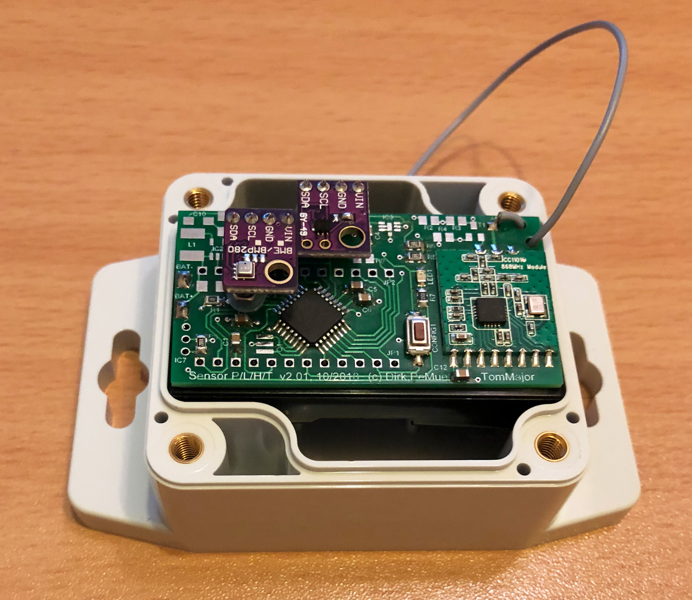

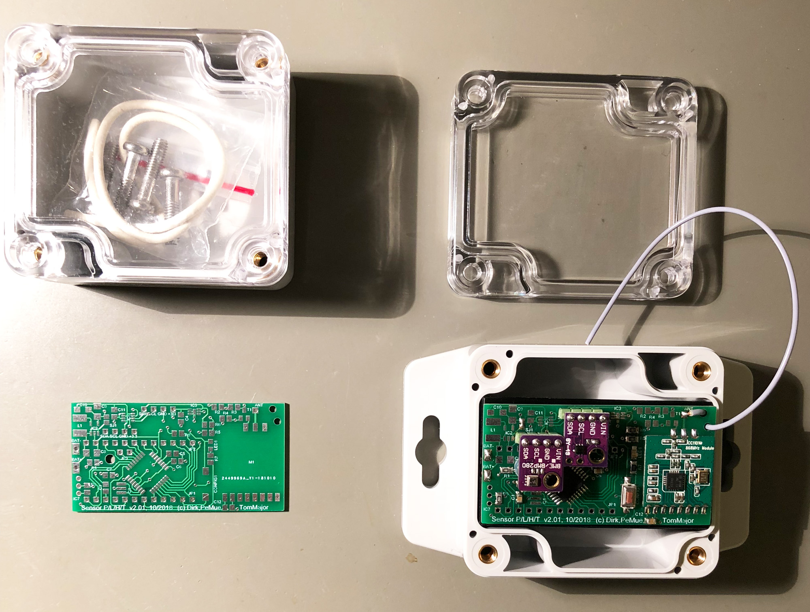

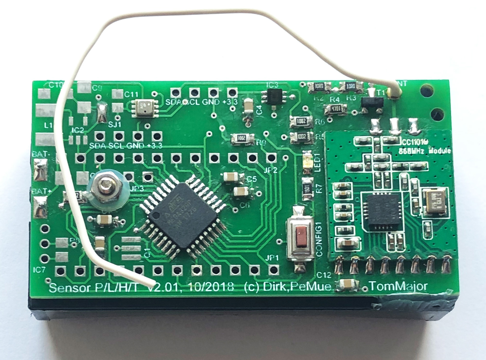

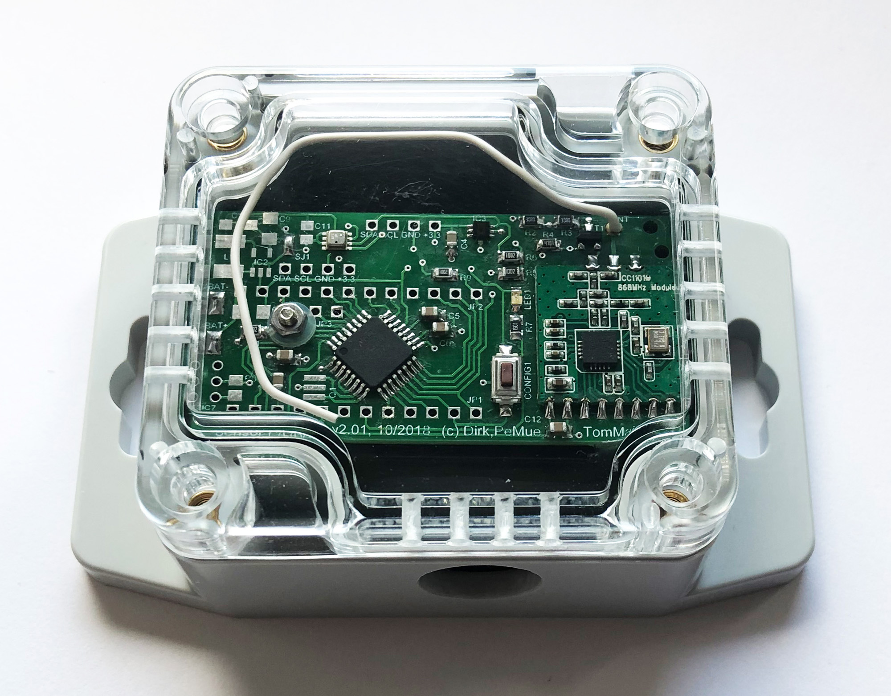

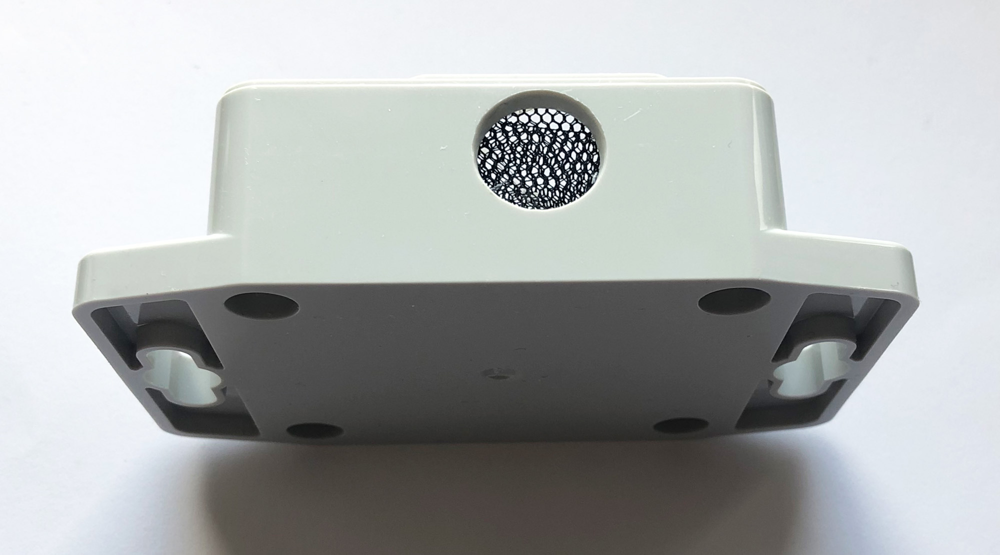

##### Beispiel Aufbau Innensensor - Version i2.20
 

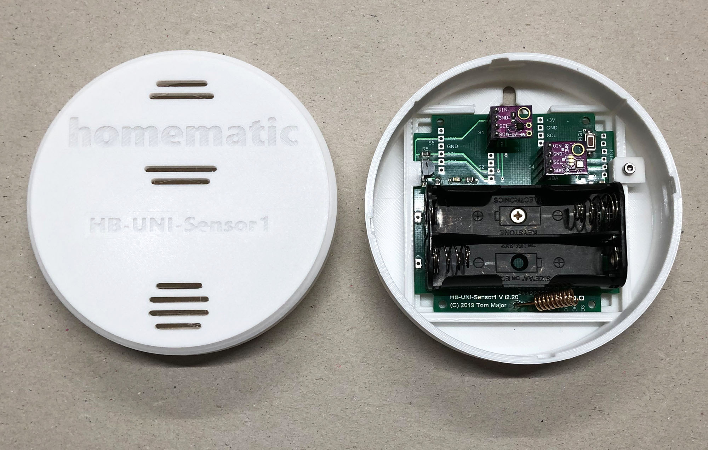

## Schaltplan

[:arrow_right: Schaltplan - Version 2.01](PCB/Files/SensorPLHT_v201.pdf)

[:arrow_right: Schaltplan - Version i2.20](PCB/Files/HB-UNI-Sensor1_Vi2.20.pdf)

## Platine

##### Version 2.01
 

##### Version i2.20
 

## Gerber

[:arrow_right: PCB Gerber](PCB)

## Mögliche I2C Adressen der Sensoren

Die I2C Adressen lassen sich (falls der Sensor das unterstützt) meisten am Sensor Breakout-Board über eine Lötbrücke einstellen und müssen zu den im Sketch definierten Adressen passen!

| Sensor | Adressen (hex) | Bemerkungen |
| --- | --- | --- |
| DS18B20 | - | OneWire, kein I2C Sensor |
| BME280 | 76, 77 | wählbar über Pin |
| BMP180 | 77 | - |
| MAX44009 | 4A, 4B | wählbar über Pin |
| TSL2561 | 29, 39, 49 | wählbar über Pin |
| BH1750 | 23, 5C | wählbar über Pin |
| SHT21 | 40 | - |
| SHT10 | - | kein I2C Sensor, kann aber die I2C Pins mitbenutzen |
| VEML6070 | 38+39 (+0C) | beide 3x Adressen werden benötigt, 0C unklar |
| VEML6075 | 10 | - |
| 24AA025UID | 50..57 | kein Sensor, ggf. für später für UID vorgehalten |

## Messung der Batteriespannung

- Option 1: Standard, UBatt = Betriebsspannung AVR 
keine zusätzliche Hardware notwendig 
`#define BAT_SENSOR tmBattery` 

- Option 2: Batteriespannungsmessung für StepUp/StepDown 
2 zusätzliche Widerstände notwendig 
`#define BAT_SENSOR tmBatteryResDiv<A0, 9, 5700>` 
`// sense pin A0, activation pin D9, Faktor = Rges/Rlow*1000, z.B. 470k/100k, Faktor 570k/100k*1000 = 5700`

- Option 3: Echte Batteriespannungsmessung unter Last 
`#define BAT_SENSOR tmBatteryLoad<A0, 9, 4000, 200>` 
`// sense pin A0, activation pin D9, Faktor = Rges/Rlow*1000, z.B. 10/30 Ohm, Faktor 40/10*1000 = 4000, 200ms Belastung vor Messung`

Die Batteriespannungsmessung unter Last dient u.a. dem Schutz vor einem "Babbling Idiot, siehe
[Babbling Idiot Protection](https://github.com/TomMajor/SmartHome/tree/master/Info/Babbling%20Idiot%20Protection)
  
Aus meiner Sicht würde es sehr helfen, eine echte Messung des Batteriezustands unter Last zu haben, um frühzeitig leere Batterien zu erkennen und zu tauschen. Bekanntermaßen sagt eine Spannungsmessung an unbelasteter Batterie, je nach Batterie- bzw. Akkutyp, nicht viel über den Ladezustand aus.
  
Die Schaltung belastet die Batterie bzw. den Akku für einige Hundert Millisekunden und misst dabei die Spannung.
Dies führt meiner Meinung nach zu realistischeren Werten über den Batteriezustand als eine asynchrone und unbelastete Messung.
  
Dazu wurde eine neue Batterieklasse nach Vorbild von papas Batterieklassen erstellt. Sie heißt hier tmBatteryLoad und befindet sich unter Sensors/tmBattery.h  
Die Aktivierung ist oben in Option 3 dargestellt. 
Mit dieser Klasse und der Schaltung werden die Batterien bei 3V mit ca. 75mA für die kurze Zeit der Messung belastet. Anpassungen an andere Spannungen und Ströme sind natürlich leicht über die Widerstände R2/R3 möglich. Momentan geschieht das 2 mal am Tag. 
`battery.init(seconds2ticks(12UL * 60 * 60), CLOCK);` 

Das Bild zeigt den Einbruch der Batteriespannung wenn für 200ms mit 75mA belastet wird. Die Spannung bricht um 142mV ein und wird am Ende der 200ms gemessen.
 

## Verringerung Ruhestrom

[:arrow_right: Verringerung Ruhestrom](https://github.com/TomMajor/SmartHome/tree/master/Info/Ruhestrom)

## Aufbau

##### Version 2.01
 

- alle SMD Widerstände und Kondensatoren haben die Bauform 0805 (außer die Kondensatoren für den optionalen Step-up Wandler, die haben 1206).

- Gehäuse mit Klarsichtdeckel: GAINTA G201C (ohne Befestigunslaschen), GAINTA G201CMF (mit Befestigunslaschen)

- Batteriehalter 2xAA: COMF BH-321-1A

- MOSFET für Option 'Echte Batteriespannungsmessung unter Last'
    * Meine Wahl: IRML6344 (Gate Threshold Voltage - GTV) 0,8V, RDSon 27mOhm, 5A, SOT-23 Gehäuse, Pinout Gate 1, Source 2, Drain 3, N-Channel)
    * Es gehen natürlich auch günstigere bzw. leichter beschaffbare MOSFETs, wichtig ist das dieser bei minimaler Betriebsspannung des Sensors (nehmen wir mal 2V an) sicher durchschalten kann (GTV) und das der RDSon möglichst klein im Bezug zu den Widerständen des Spannungsteilers R2/R3 ist.
    Und natürlich muss er den gewählten Laststrom aushalten und das Pinout muss passen.
    * Der Si2302 zum Beispiel wäre auch gut geeignet, ist leichter beschaffbar und günstiger (aliexpress), GTV 0,7V, RDSon 85mOhm, 2,6A.
    * HM user 'klassisch' weist auf den Umstand hin dass der GTV Wert nicht der Wert ist, beim dem der MOSFET sicher leitet sondern da fängt er gerade (mit minimalen Strom) erst an zu leiten. Die Spannung muss also für sicheres Durchschalten schon etwas höher sein als die GTV. Bei den genannten MOSFET IRML6344 und Si2302 ist das kein Problem, z.B. hat der IRML6344 bei Vgs 2,5V einen Widerstand von 27mOhm. Bei anderen MOSFET sollte man ins Datenblatt schauen und sicherstellen dass die Leitfähigkeit bei minimaler Betriebsspannung gegeben ist.
  
- Spule für optionalen Step-Up Wandler: Murata LQH43CN100K03L oder vergleichbare, unbedingt Strom und DC-Widerstand beachten, aus Produktrange 'Power lines', 'DC/DC' o.ä.

Bestückungsvarianten

| Thema | Variante | zu bestückende Bauelemente |
| --- | --- | --- |
| CC1101 | immer | M1, R9, C12 |
| Interface | immer | LED1, R7, CONFIG1 |
| I2C | immer | R5, R6 |
| CPU | ATmega328P Chip | IC1, R1, C1, C5, C6, C7 |
| CPU | Arduino Pro Mini | über Pin Header JP1, JP2, JP3 stecken oder löten |
| I2C Sensoren | Temperatur, Luftdruck, Luftfeuchte, Helligkeit | nach Bedarf IC3 + C4, IC6 + C11, SV1, SV2 |
| 1-Wire Sensor DS18B20 | Temperatur | IC7, R8 |
| Betriebsspannung | Standard 2x AA (3V) | SJ1 geschlossen |
| Betriebsspannung | Step-Up 1x AA oder Akku (1,2-1,5V) | MAX1724, L1, C8, C9, C10, SJ1 offen |
| Betriebsspannung | >3V | nur mit LDO, extern oder LDO auf dem Arduino Pro Mini, SJ1 offen |
| Messung Batteriespannung | Standard 3V | keine zusätzlichen Bauelemente nötig |
| Messung Batteriespannung | Step-Up MAX1724 | R2 470k, R3 100k, SJ2 geschlossen |
| Messung Batteriespannung | Messung unter Last (Schutz vor "Babbling Idiot") | R2 30, R3 10, T1, R4 bestücken, SJ2 offen, R2/R3 an gewünschten Laststrom anpassen |

##### Version i2.20
 

- alle SMD Widerstände und Kondensatoren haben die Bauform 0805

- Gehäusevariante 1 (Innen): PP042W-S / BOX-SENS-WHITE  
[BOX-SENS-WHITE](https://www.tme.eu/de/details/box-sens-white/gehause-fur-alarmanlagen-und-sensoren/supertronic/pp042w-s)

- Gehäusevariante 2 (Innen): 3D Druck, Design by Jan_von_neben_an (Schmelzerboy)  
[Gehäuse HB-UNI-Sensor1](https://www.thingiverse.com/thing:3766944)

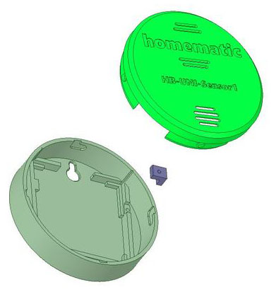

| Bauelement | Wert | Bauform | Bemerkungen | Beispiel Reichelt oder aliexpress |
|---|---|---|---|---|
| IC1 | Atmega 328P | TQFP |  | ATMEGA 328P-AU |
| IC2 | CC1101 | SMD |  | (aliexpress) |
| R1, R5, R6, R8, R9 | 10k | 0805 | R8 nur bei DS18X20 Einsatz | RND 0805 1 10K |
| R7 | 1,5k | 0805 | |  RND 0805 1 1,5K |
| C1..C7 | 100nF | 0805 | C5..C7 je nach verbauten I2C-Sensoren | X7R-G0805 100N |
| C8 | 1uF | 0805 |  | X7R-G0805 1,0/25 |
| LED1 | gelb | 0805 |  | KBT KP-2012SYC |
| CONFIG1 | DTSM-3 | 3x6x2,5mm | Tactile Push Button SMD | [aliexpress](https://de.aliexpress.com/item/32672806661.html) |
| R2..R4, T1 |  |  | Optional: Echte Batteriespannungsmessung unter Last | [Advanced Feature](https://github.com/TomMajor/SmartHome/tree/master/Info/Babbling%20Idiot%20Protection) |
| IC3 | MCP111T-XXX | SOT23 | Optional: uC-Supervisor | [Advanced Feature](https://github.com/TomMajor/SmartHome/tree/master/Info/Babbling%20Idiot%20Protection) |
| Q1 | 8 MHz | SMD | Optional: Quarz 8MHz statt int. RC-Osc. | CSTCE 8,00 |
| BAT1 | Keystone 2462 | Halter für 2xAA | oder ähnliche | - |

## Flashen

##### Version 2.01

###### 1. Bootloader (nur bei Verwendung eines ATmega328P Chips)

- Zunächst wird der Arduino Standard-Bootloader mittels eines ISP-Programmers geflasht.  Beispiele für ISP-Programmer sind u.a. ~~USBasp~~, Diamex, Atmel-ICE. Auch ein Arduino Uno kann zum ISP-Programmer umfunktioniert werden.
- Die ISP Programmierung läuft über 6 Pins und so sieht die Anschlussbelegung zu JP2 auf der Platine aus:

| ISP | JP2 Pin |
| --- | --- |
| GND | 2 |
| RESET | 3 |
| +3,3V | 4 |
| SCK | 9 |
| MISO | 10 |
| MOSI | 11 |

- Es reicht die Pins auf JP2 aufzustecken und leicht zu verkanten, so wie im Foto zu sehen, der Bootloader muss nur einmal programmiert werden.
- Für den Vorgang muss der Chip aufgelötet sein und mit Spannung versorgt werden. Falls ein externer Quarz eingesetzt werden soll muss auch dieser bestückt sein.
- Wenn der ISP-Programmer einmal dran ist sollten auch gleich die Fuses geprüft und ggf. angepasst werden (Oszillator, BOD usw.).
- Beispiele für Bootloader und Fuse-Einstellungen:
[Bootloader HB-UNI-Sensor1](https://github.com/TomMajor/SmartHome/tree/master/Info/Bootloader)

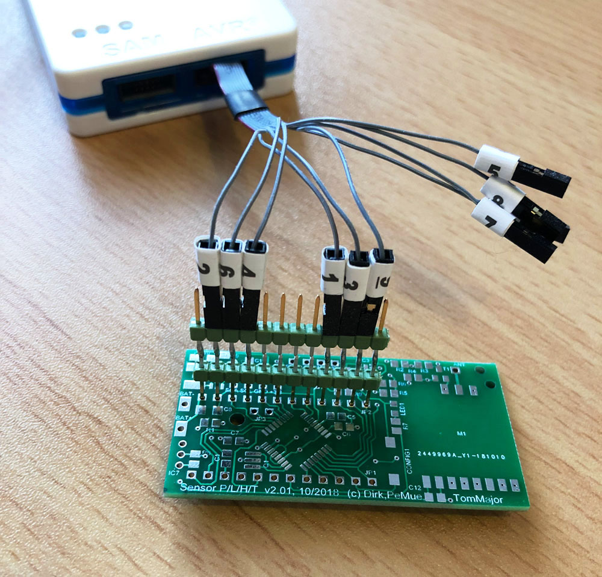

###### 2. Applikation / Sketch

- Wenn der Bootloader vorhanden ist kann ganz normal mittels eines FTDI-Adapters direkt aus der Arduino IDE seriell programmiert werden. Dazu werden 4 Pins an JP1 verwendet:

| FTDI | JP1 Pin |
| --- | --- |
| RXD | 12 |
| TXD | 11 |
| DTR | 10 |
| GND | 9 |

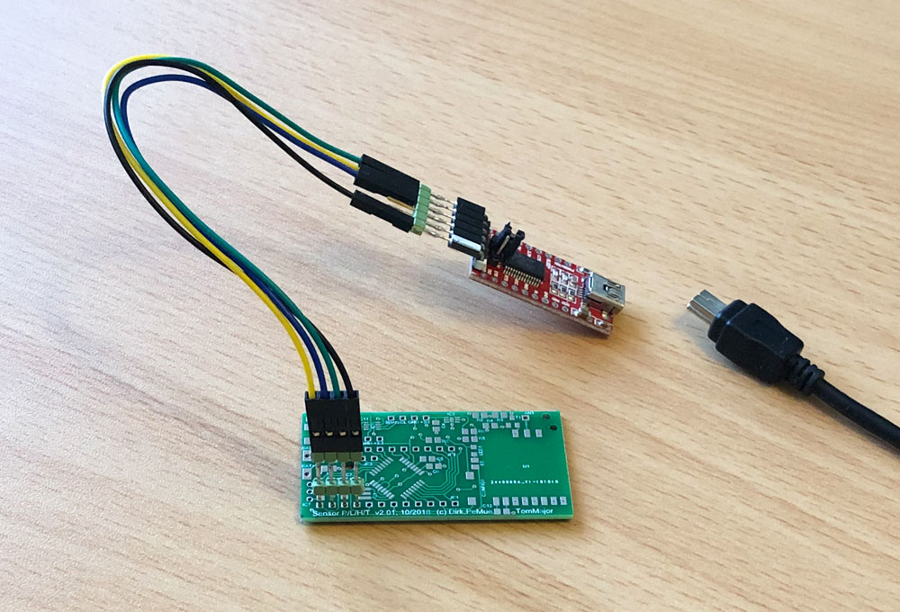

##### Version i2.20

###### 1. Bootloader

- Zunächst wird der Arduino Standard-Bootloader mittels eines ISP-Programmers geflasht.  Beispiele für ISP-Programmer sind u.a. ~~USBasp~~, Diamex, Atmel-ICE. 
Auch ein Arduino Uno kann zum ISP-Programmer umfunktioniert werden.
- Die ISP Programmierung läuft über 6 Pins vom Steckverbinder K2.
- Achtung, K2 muss von hinten kontaktiert werden! Pin1 ist gekennzeichnet.
- Es reicht die Pins des Programmers auf K2 aufzustecken und ggf. leicht zu verkanten, die Lötpunkte sind aber schon versetzt angeordnet so dass die Pins automatisch halten sollten. Der Bootloader muss nur einmal programmiert werden.
- Für den Vorgang muss der Chip aufgelötet sein und mit Spannung versorgt werden. Falls ein externer Quarz eingesetzt werden soll muss auch dieser bestückt sein.
- Wenn der ISP-Programmer einmal dran ist sollten auch gleich die Fuses geprüft und ggf. angepasst werden (Oszillator, BOD usw.).
- Beispiele für Bootloader und Fuse-Einstellungen:
[Bootloader HB-UNI-Sensor1](https://github.com/TomMajor/SmartHome/tree/master/Info/Bootloader)

###### 2. Applikation / Sketch

- Wenn der Bootloader vorhanden ist kann ganz normal mittels eines FTDI-Adapters direkt aus der Arduino IDE seriell programmiert werden.
- Dazu wird K1 verwendet, dabei auf die richtige Reihenfolge der Pins zwischen Platine und FTDI-Adapter achten.
- Auch bei K1 sind die Lötpunkte versetzt angeordnet so dass die Pins automatisch halten sollten.

## Changelog

##### Version 2.01 (gegenüber Dirk/PeMue 1.60)
 

- HB-UNI-Sensor1 für Außen- oder Innenanwendungen, 10/2018
- MAX44009 hinzugefügt
- BMP180 entfernt (Ersatz durch BME280)
- TSL2561 entfernt (Ersatz durch MAX44009) warum? [Vergleich TSL2561 MAX44009](https://github.com/TomMajor/SmartHome/tree/master/Info/SensorTest_Lux)
- Zweite I2C Stiftleiste für zusätzliche Sensoren auf Breakout-Boards
- Schaltung für echte Batteriespannungsmessung unter Last hinzugefügt
- 10k pull-up Widerstand am ChipSelect des CC1101 für sicheres ISP-Flashen (Bootloader) mit verbautem CC1101
- Option: Miniatur-Quarz 8MHz bestückbar (anstatt int. RC-Osc.)
- alle Abstände der Leiterbahnen gegeneinander auf min. 0,25mm vergrößert
- Layout entflochten und verbessert
- Lötpads für BME280 und MAX44009 nach außen verlängert falls man versuchen will diese ohne Reflow oder Heisßluft zu löten

##### Version i2.20 (gegenüber V2.01)
 

- HB-UNI-Sensor1 für für Außen- oder Innenanwendungen, 07/2019
- Weiterentwicklung vom PLHT Sensor Version 2.01 mit anderen Gehäusevarianten
- Bestückung mit ATmega328P, RC-Oszillator als Standard
- Sensoren für Temperatur (DS18x20, BME280), Luftdruck (BME280, BMP180), Luftfeuchte (BME280, SHT10, SHT21), Helligkeit (MAX44009, TSL2561, BH1750), UV-Index (VEML6070, VEML6075) uvm. bestückbar
- 5x I2C Stiftleisten vorhanden, damit können bis zu 5 I2C Sensoren auf Breakout-Boards parallel bestückt werden
- 1-Wire Temperatursensor DS18x20 bestückbar
- Spannungsversorgung: Batterien/Akku 2 AA-Zellen
- Die nicht benutzten Arduino Pins 3, 6, 7, A0 sind auf einem extra Steckverbinder für Erweiterungen herausgeführt (K3)
- Option: Echte Batteriespannungsmessung unter Last (Schutz vor "Babbling Idiot")
- Option: uC-Supervisor MCP111 bestückbar (Schutz vor "Babbling Idiot")
- Option: Miniatur-Quarz 8MHz bestückbar (anstatt int. RC-Osc.)

## Verbesserungen für's nächste Redesign

##### Version 2.01
 

- das linke Bohrloch D2,5mm besser zu den vorhandenen Löchern im Batteriehalter ausrichten, zweites Bohrloch rechts vorsehen (TomMajor)
- Arduino Pro Mini Leiste JP2/U-Bat: Jumper vorsehen um beim Pro Mini den Eingang des LDO abzuklemmen, der LDO wird bei Batteriebetrieb nicht benötigt. Am Besten ist es sowieso den LDO zu entfernen um Ruhestrom zu sparen. (TomMajor)
- MAX44001 und BME280 Pin 1 Markierungen nachtragen (PeMue)
- SHT10 optional (kpwg)
- die Breakout-Boards Pinreihen beide am Rand platzieren und mit Abstand zueinander - aktuell musste ich am MAX44009 feilen, damit es passte (kpwg)
- alle wichtigen Beschriftungen des Bestückungsdruckes größer machen - die Chinesen haben offenbar Probleme mit so kleinen Zeichen (kpwg)
- die LED Pads als 1206 vorsehen - 0805 lässt sich auf 1206 gut auflöten, aber 1206 auf 0805 ist schon grenzwertig (kpwg)
- ich verfolge etwas die Diskussion über GND bei der Antennen des CC1101. Um da flexibler zu sein (also eventuell die Durchkontaktierung aufbohren zum Trennen) ist es eventuell besser, sich das GND für den T1 aus einer getrennten Durchkontaktierung und nicht aus dem linken GND des CC1101 zu holen. (harvey)
- ISP-Header zum bequemen initialen Prog. des Bootloaders - noch unklar ob im Layout machbar (TomMajor, kpwg)
- ~~Den CC1101 1,5mm vom Rand weg versetzen damit der Klarsichtdeckel des GAINTA G201 Gehäuses besser passt (TomMajor)~~
- Die Platine links und rechts je 1,5mm kürzer machen damit der Klarsichtdeckel des GAINTA G201 Gehäuses besser passt (TomMajor)
- Option für Arduino Pro Mini Modul loswerden, nur noch ATmega328P chip, damit dann besseres Layout für 3x Sensor Breakout-Boards möglich (TomMajor)
- das Lötpad GDO2 am CC1101 kann im Platinenlayout entfernt werden da nicht benötigt (TomMajor)

##### Version i2.20
 

- die Befestigungslöcher der Platine für das BOX-SENS-WHITE Gehäuse müssen ca. 1mm weiter auseinander (TomMajor)
- das Lötpad GDO2 am CC1101 kann im Platinenlayout entfernt werden da nicht benötigt (TomMajor)
- den optionalen Miniatur-Quarz um 90° drehen damit ein 32kHz Quarz optional liegend bestückt werden kann + ggf. 2 weitere SMD Kond. für diesen 32kHz Quarz (harvey)
- ggf. Lötpads für einen 2. DS18x20 vorsehen um einen Differenztemperatursensor zu realisieren (der 2. DS18x20 geht dann nach Extern) (harvey)

## Bestellung der Platine

Wer den Sensor nachbauen möchte, aber noch nie eine Platine bestellt hat:
- Es gibt unzählige Hersteller für Leiterplatten. Früher habe ich oft in Deutschland bestellt, bei Firmen wie Beta Layout und ähnlichen. Seit ein paar Jahren ist die Direktbestellung in China ziemlich unkompliziert und preislich sehr attraktiv geworden, deswegen bestelle ich mittlerweile meistens dort. 
Gute Erfahrungen habe ich z.B. mit JLCPCB gemacht, die Platinen kosten meisten nur ein paar Euro und sind innerhalb von 2-3 Wochen da.
- Die Gerberdateien können direkt beim Anbieter hoch geladen werden und man sieht eine Vorschau wie die Platine aussehen wird.
- Im folgenden Bild sind die Bestellparameter für die PLHT Sensor Platine zu sehen:

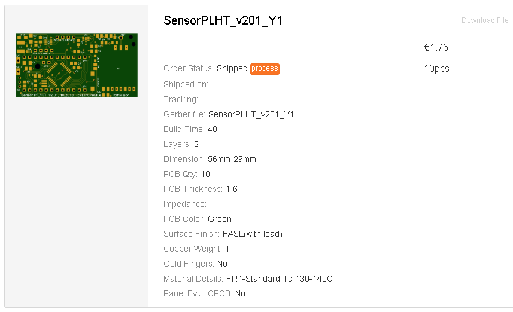

## RaspberryMatic/CCU Installation

Einstellungen/Systemsteuerung/Zusatzsoftware -> Datei CCU_RM/HB-UNI-Sensor1-addon.tgz installieren.

## RaspberryMatic WebUI

Der angemeldete Sensor auf der RaspberryMatic:

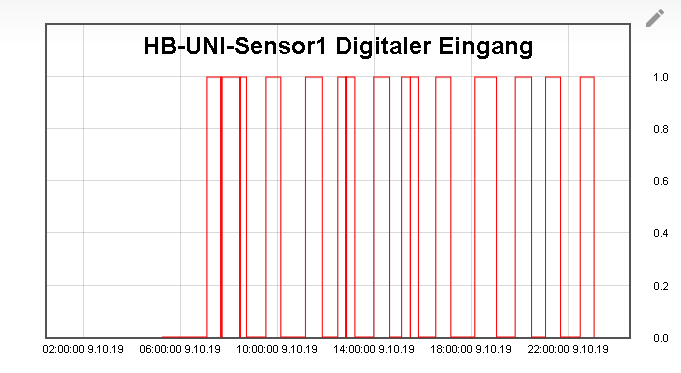

## FHEM Installation

Die Datei FHEM/HMConfig_UniSensor1.pm nach /opt/fhem/FHEM kopieren, dann FHEM neustarten.

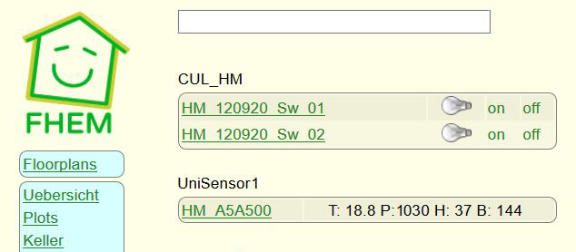

**Parameter Höhe einstellen:** 
"Ich konnte bei meinem THPL Sensor mit BME280 und MAX44009 über getConfig // **Config drücken** // set regSet altitude 590 // **Config drücken** // getConfig // **Config drücken** die Höhe einstellen. Bitte berichtigt mich, wenn ich da zu viel drücke und mache- so hat es jedenfalls funktioniert ::)" 
FHEM user *kpwg*

## Serieller Log beim Start des Sensors

- define NDEBUG ist deaktiviert: 
`//#define NDEBUG`

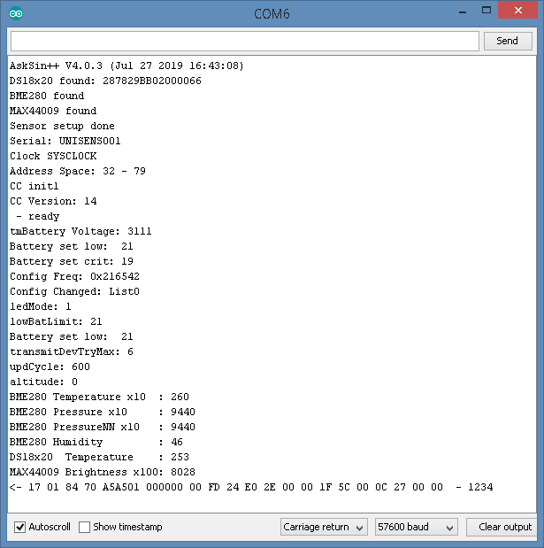

## Trägheit verschiedener Temperatursensoren

Der Temperaturwert des BME280 reagiert träger als andere Temperatursensoren, dies liegt m.E. an der engen thermischen Kopplung zwischen aufgelötetem Chip und Platine und der daraus resultierenden thermischen Trägheit des Systems. 
Temperatursensoren die nur über ihre Anschlüsse in der Luft hängen reagieren schneller.  
Ich empfehle daher für die Temperaturmessung einen zusätzlichen DS18x20 zu verbauen und die Temperatur des BME280 zu ignorieren. Im Sketch ist das entsprechend berücksichtigt. 
 
Vergleich der BME280 / DS18B20 / SHT10 Temperaturwerte bei einem 6K Sprung 
Quelle: FHEM user *Gernott* 
*'Links war der BME280-breakout horizontal positioniert, recht vertikal über eine Kante stehend. Dort wir der Sensor offenbar besser angeströmt und reagiert dann deutlich schneller. Der SHT hing ohne breakout dünn verdrahtet im Raum und reagiert ziemlich schnell.'*

## Benutzerspezifische Sensordaten

Ab Firmware 0x13 können zwei extra Byte 'customData' in der Payload mit benutzerspezifischen Daten belegt
und mit einer alternativen Firmware xml-Datei der RaspberryMatic/CCU2/CCU3-Zentrale bzw. mit dem Perl-Skript FHEM zur Verfügung gestellt werden.

Diese alternative Firmware xml-Datei muss für die Behandlung von 'customData' angepasst werden und im Verzeichnis 
`/usr/local/addons/hb-uni-sensor1/custom_firmware` 
liegen.

Das AddOn Skript sorgt dann dafür, dass die alternativen Firmware xml-Dateien bei Aktionen wie
- AddOn Update-Installation,
- Einspielen eines RaspberryMatic/CCU2/CCU3 Backups,
- Update der RaspberryMatic/CCU2/CCU3 Firmware

wieder in das richtige Verzeichnis kopiert und in der Zentrale berücksichtigt werden.

Ein Beispiel für eine alternative Firmware xml-Datei, die zusätzlich den gemessenen UV-Index für den VEML6070 Sensor zur Verfügung stellt, liegt nach Installation des AddOn im Verzeichnis 
`/usr/local/addons/hb-uni-sensor1/custom_firmware_bsp`

HomeMatic: 
Zur Aktivierung muss dieses Verzeichnis in  
`custom_firmware` 
umbenannt und anschließend die Zentrale neugestartet werden.

Danach (und bei jeder weiteren eventuellen Änderung in der alternativen Firmware xml-Datei) muss ein bereits vorhandener HB-UNI-Sensor1 abgelernt/gelöscht und wieder neu angelernt werden! 
Nur so werden die xml Änderungen in die Zentrale übernommen.

FHEM: 
2 auskommentierte Beispiele für den UV-Index von VEML6070 bzw. VEML6075 sind am Ende des Perl-Skripts HMConfig_UniSensor1.pm vorhanden.

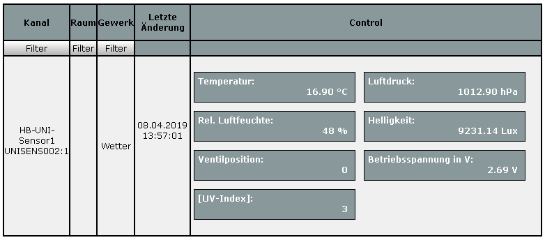

## Optionaler Reset-Baustein MCP111

- In einigen meiner Schaltungen ist der optionale Reset-Baustein MCP111 zu sehen. Dieser hat den Vorteil eines sehr geringen Ruhestromes von < 1µA gegenüber dem integrierten Brown-out Detector (BOD) im AVR, dieser benötigt ca. 18µA (@3V).
- Dabei verwende ich typischerweise den MCP111-240, der bei nominal 2,32V den Reset für den AVR aktiviert. Kombiniert mit der Batteriespannungsmessung unter Last (Babbling Idiot Protection, siehe oben) ist das ein gutes Schutzkonzept gegen Dauersender durch leere Batterien oder Akkus. Ein Dauersender kann sehr schnell das gesamte Funknetz im Haus lahmlegen.
- Die Reset-Spannung von 2,32V ergibt pro Zelle eine Entladeschlußspannung von 1,16V (bei 2 Zellen). Aus meiner Sicht ist diese Entladeschlußspannung gleichermaßen für AA Alkaline-Zellen oder NiMH Akkus geeignet, auch wenn man im Alkaline Fall etwas Energie verschenkt.
- Als Low-Batt Schwelle für das Gerät könnte man dann z.B. 2,4V wählen.

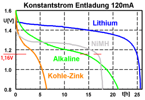

## Bewegungsmelder mit PIR AS312 am digitalen Eingang

- Der Inverter mit Transistor sorgt für minimalen Ruhestrom (keine Bewegung, PIR Ausgang Low, Transistor gesperrt) und trägt außerdem durch die Entkopplung zum sicheren Betrieb bei (keine unerwünschte Auslösung des PIR während des 868MHz Sendevorgangs an die Zentrale).
- Die Bilder demonstrieren die Ideen und den konstruktiven Aufbau von FHEM user *fhemfreund*, getrimmt auf minimale Gerätegröße. Danke für den Ideenaustausch und das zur Verfügung gestellte Gerät. :smile:
- Mit der RTC Option beträgt der Ruhestrom inklusive PIR nur ca. 14uA und es besteht somit die Hoffnung dass die eingesetzte Batterie CR2450 möglichst lange hält.

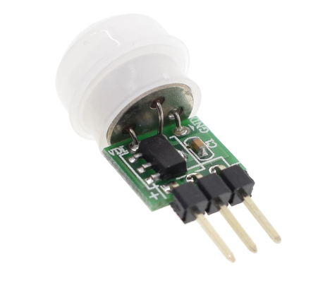

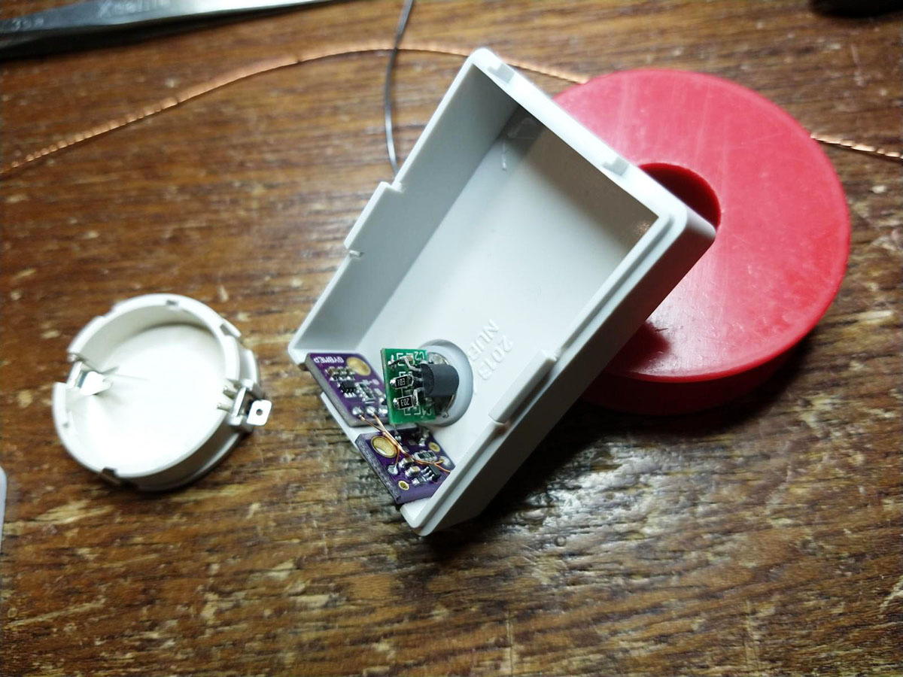

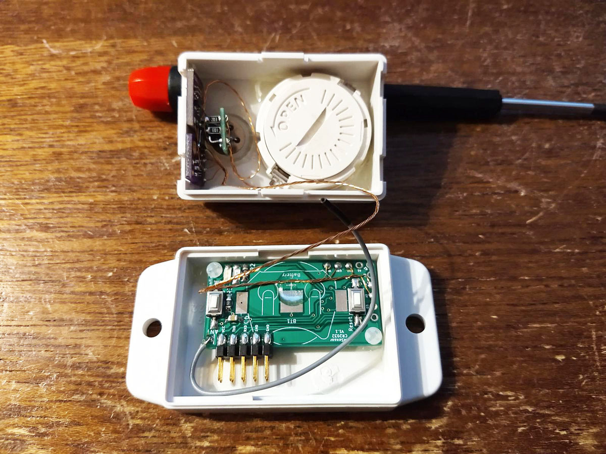

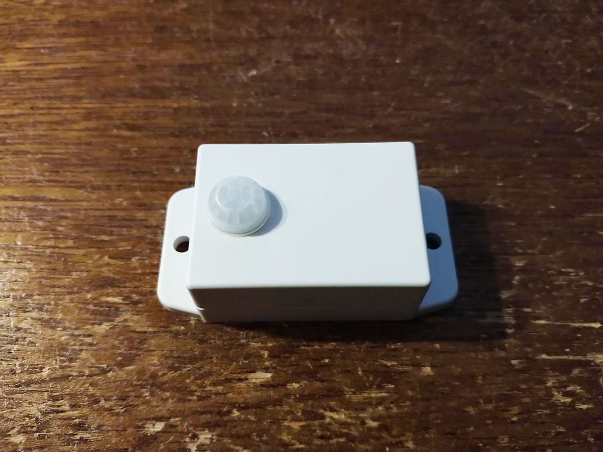

## :exclamation: Warnung vor dem Flashen von 3,3V Geräten mit USBasp Klones

[:arrow_right: Warnung](https://github.com/TomMajor/SmartHome/tree/master/Info/Warnung_Flashen_33_USBasp_Klones)

## Links

[HomeMatic Forum: Hardwareentwicklung und Selbstbau von Aktoren und Sensoren](https://homematic-forum.de/forum/viewforum.php?f=76)

[HomeMatic Forum: HB-UNI-Sensor1 - Neuauflage](https://homematic-forum.de/forum/viewtopic.php?f=76&t=51927)

[HomeMatic Forum: Nachbau HB-UNI-Sensor1](https://homematic-forum.de/forum/viewtopic.php?f=76&t=43887)

[FHEM Forum: Selbstbau HM_WDS10_TH_O mit Luftdruckmessung](https://forum.fhem.de/index.php/topic,20620.0.html)

[FHEM Forum: AskSin++ Library](https://forum.fhem.de/index.php/topic,57486.0.html)

## Benötige Libraries

[AskSinPP Library](https://github.com/pa-pa/AskSinPP) 
[EnableInterrupt](https://github.com/GreyGnome/EnableInterrupt) 
[Low-Power](https://github.com/rocketscream/Low-Power)

Für einen DS18x20 Sensor (Temperatur): 
[OneWire](https://github.com/PaulStoffregen/OneWire)

Für einen BME280 Sensor (Temperatur/Druck/Feuchte): 
[BME280](https://github.com/finitespace/BME280)

Für einen BMP180 Sensor (Temperatur/Druck): 
[BMP180](https://github.com/enjoyneering/BMP180)

Für einen MAX44009 Sensor (Helligkeit in Lux): 
keine zusätzliche Library nötig.

Für einen TSL2561 Sensor (Helligkeit in Lux): 
[TSL2561](https://github.com/adafruit/TSL2561-Arduino-Library)

Für einen BH1750 Sensor (Helligkeit in Lux): 
[BH1750](https://github.com/hexenmeister/AS_BH1750)

Für einen SHT21/Si7021 Sensor (Temperatur/Feuchte): 
[SHT21](https://github.com/jayjayuk/Si7021-Humidity-And-Temperature-Sensor-Library)

Für einen SHT10 Sensor (Temperatur/Feuchte): 
[SHT10](https://github.com/spease/Sensirion)

Für einen VEML6070 Sensor (UV-Index): 
keine zusätzliche Library nötig.

Für einen VEML6075 Sensor (UV-Index): 
[VEML6075](https://github.com/schizobovine/VEML6075)

## Lizenz

**Creative Commons BY-NC-SA** 
Give Credit, NonCommercial, ShareAlike

 This work is licensed under a <a rel="license" href="http://creativecommons.org/licenses/by-nc-sa/4.0/">Creative Commons Attribution-NonCommercial-ShareAlike 4.0 International License</a>.
