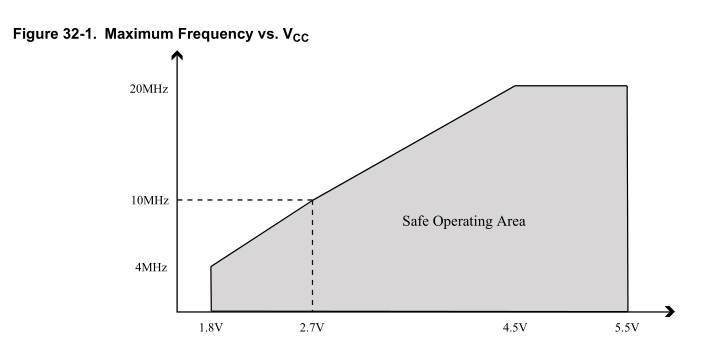
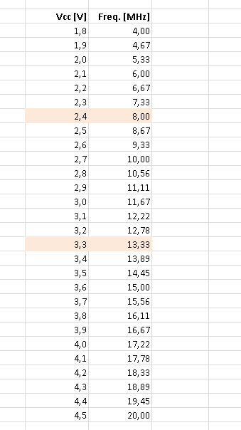

## ATmega328P - Maximale Taktfrequenz bei einer bestimmten Betriebsspannung

- Das Diagramm *Maximum Frequency vs. VCC* aus dem ATmega328P Datenblatt zeigt die maximal zulässige (garantierte) Taktfrequenz bei einer bestimmten Betriebsspannung, das sogenannte *Safe Operating Area*.

- Die Kurve hat zwei unterschiedliche Steigungen, eine im Bereich von 1,8V bis 2,7V, die andere im Bereich von 2,7V bis 4,5V.

- Daraus wurde die untenstehene Tabelle für die maximale Taktfrequenz bei einer bestimmten Betriebsspannung in 0,1V Schritten berechnet. Sie berücksichtigt die beiden unterschiedlichen Steigungen.

- In der Regel lässt sich ein AVR auch etwas außerhalb des Safe Operating Area betreiben, ich hatte z.B. mal früher eine Applikation, bei der ich einen AT90CAN128 erfolgreich mit 22MHz laufen lassen konnte. 
Im Sinne eines zuverlässigen Betriebes würde ich jedoch empfehlen, das Safe Operating Area einhalten.

- Beispiel: Ein 3,3V/8MHz Arduino Pro Mini liesse sich bei seinen 3,3V sicher bis 13,3Mhz betreiben wenn man den Resonator austauscht. 
Andererseits könnte man mit dem verbauten 8MHz Resonator mit der Betriebsspannung bis auf 2,4V runtergehen.

