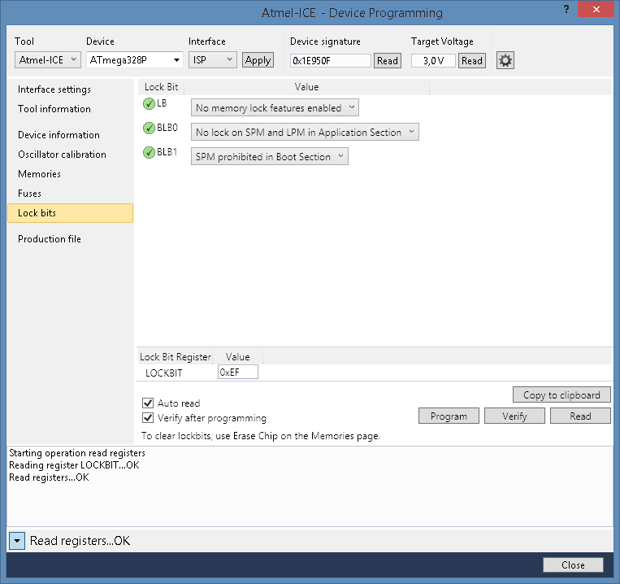
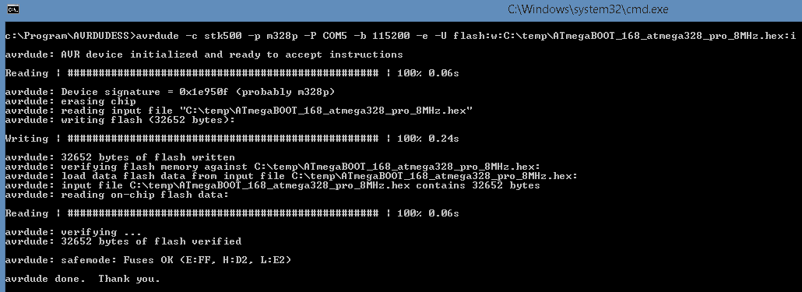

### Bootloader/Fuses/Flashspeicher flashen mit avrdude

#### Bootloader ATmega1284P

- Standard ATmega1284P Bootloader, 8MHz, für HB-DIS-EP-42BW

-> [Quarz_Osc 1284P](https://github.com/TomMajor/SmartHome/tree/master/Info/Bootloader/mega1284)

#### Standard Bootloader ATmega328P Quarz oder RC-Oszillator

- Standard ATmega328P Bootloader (ATmegaBOOT), 8MHz: *ATmegaBOOT_168_atmega328_pro_8MHz.hex*
- mit früher Watchdog-Abschaltung, damit kann man in eigenen Sketchen den WD-Reset nutzen: *ATmegaBOOT_168_atmega328_pro_8MHz_wdt.hex*
- in einem ProMini 8MHz aus China enthaltener Bootloader: *ProMiniChina8MHz_OriginalBootloader.hex*

-> [Quarz-Osc 328P](https://github.com/TomMajor/SmartHome/tree/master/Info/Bootloader/mega328/Quarz_Osc)

#### Bootloader ATmega328P RC-Oszillator mit Kalibrierung

- Kalibrierung der RC-Oszillatorfrequenz für erhöhte Genauigkeitsanforderungen ohne Verwendung eines Quarzes
- Bootloader für RC-Oszillator mit Auslesen der Frequenzkalibrierung aus dem EEPROM
- der Wert für die Frequenzkalibrierung kann vorher mit dem Sketch OSCCAL ermittelt und in den EEPROM geschrieben werden

-> [RC-Osc Cal. 328P](https://github.com/TomMajor/SmartHome/tree/master/Info/Bootloader/mega328/RC_Osc_Cal)

#### Atmel AVR Fuse Calculator

[Engbedded Atmel AVR® Fuse Calculator](http://www.engbedded.com/fusecalc/)

#### Fuses lesen
    avrdude -c stk500 -p m328p -P COM5 -b 115200 -U lfuse:r:lowfuse.hex:h -U hfuse:r:highfuse.hex:h -U efuse:r:extfuse.hex:h

#### Fuses schreiben
    avrdude -c stk500 -p m328p -P COM5 -b 115200 -U lfuse:w:0xE2:m -U hfuse:w:0xD2:m -U efuse:w:0xFF:m

#### Flashspeicher lesen
    avrdude -c stk500 -p m328p -P COM5 -b 115200 -U flash:r:readtest.hex:i

#### Bootloader/Flashspeicher schreiben
    avrdude -c stk500 -p m328p -P COM5 -b 115200 -e -U flash:w:C:\temp\ATmegaBOOT_168_atmega328_pro_8MHz.hex:i

 

#### AVR ISP 6-polig

 
