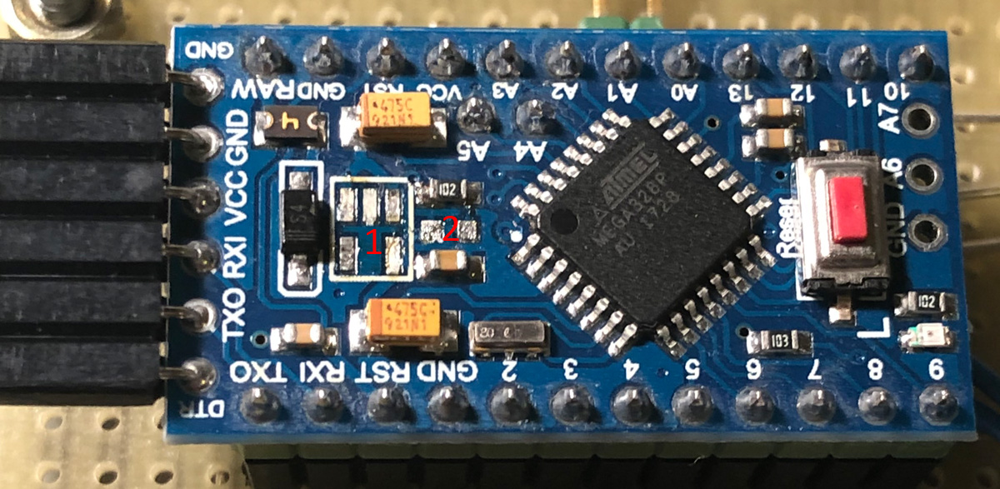
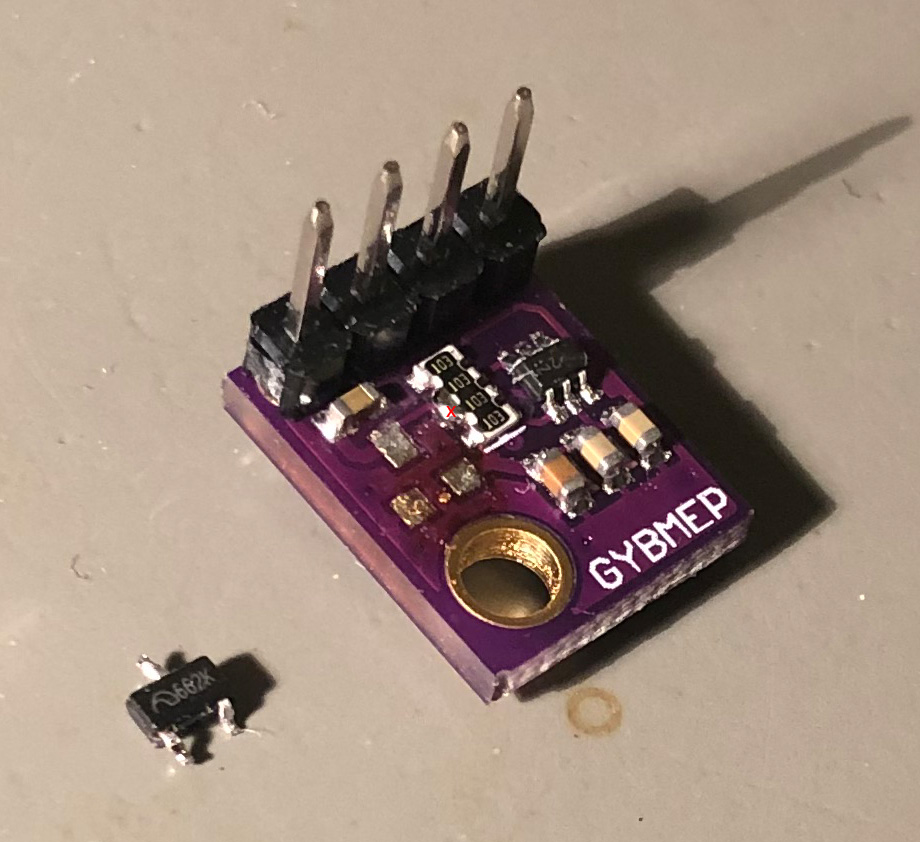
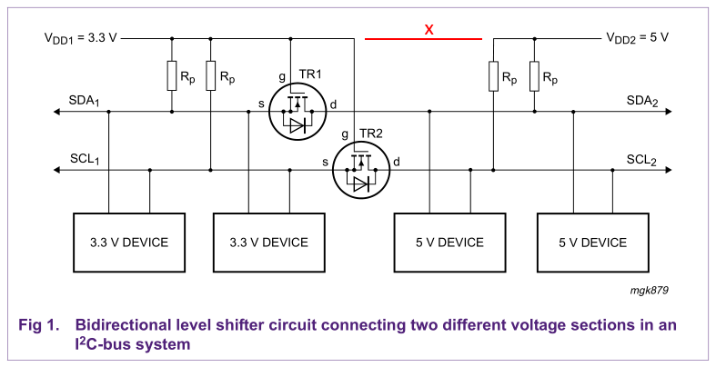
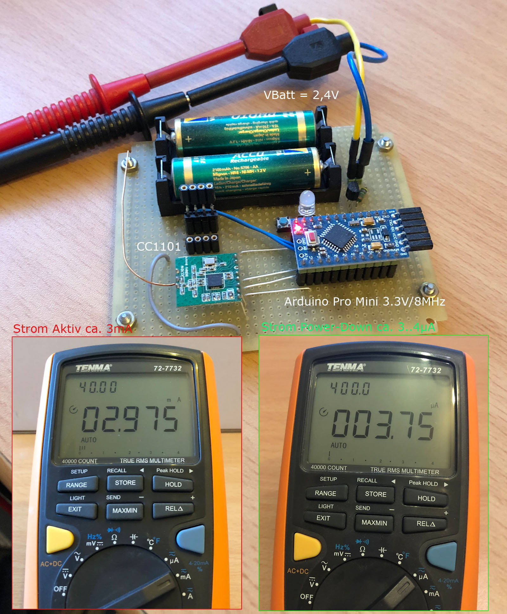

## Ruhestrom Arduino Pro Mini

- Auf dem Arduino Pro Mini sollte der LDO Spannungsregler (die Stelle ist im Bild mit 1 markiert) sowie die Power-LED (2) entfernt werden, um den Ruhestrom wesentlich zu verringern.

## Ruhestrom mit Sensor-Boards

Meine Messungen an den MAX44009 und BME280 Sensor-Boards zeigen diese Stromaufnahme im Standby:

| Sensor | Boardtyp | Strom mit LDO | Strom ohne LDO |
| --- | --- | --- | --- |
| BME280 | GYBMEP | 5 µA | 0,1 µA |
| MAX44009 | GY-49 | 6 µA | Messung folgt |

- Der LDO (oft ist der Typ 662K zu finden) ist für den Arduino 5V Betrieb gedacht. Da die AskSinPP-Geräte mit 3,3V betrieben werden (CC1101!) ist der LDO auf den Sensor-Boards unnötig und verursacht nur erhöhten Ruhestrom. Aus diesem Grund empfehle ich diesen zu entfernen.
- Danach muss Vin mit Vout gebrückt werden. Auf den Boards ist eine I2C Level-Shifter mit 2 Transistoren und 4 Widerstanden verbaut.
Das Einfachste ist es, eine kleine Lötbrücke (Vin-Vout) zwischen den 2 Widerstandspaaren zu machen, im Bild mit einem kleinem Kreuz markiert.
- Der I2C Level-Shifter funktioniert auch bei gleicher Spannung rechts und links.

## Überprüfung des Ruhestroms

- Der Sketch SleepTest.ino dient zur Überprüfung von Aktiv- und Power-Down-Strom eines Arduino Pro Mini 328 - 3.3V/8MHz mit angeschlossenem CC1101 (das wäre ein Basic HM AskSinPP Gerät ohne angeschlossene Sensoren oder andere Zusatz-HW). Die Ströme sind bei batteriebetriebenen Geräten wichtig für die Batterielebensdauer.

- Der Sketch schickt den CC1101 in den Ruhezustand und schaltet dann aller 8sec zwischen aktivem Zustand und Power-Down-Modus um. Im aktivem Zustand wird außerdem die LED an Pin 13 eingeschaltet.

- Wenn die Fuses richtig gesetzt sind und die Hardware in Ordnung ist müssen sich die gezeigten Ströme in etwa einstellen (ca. 3mA im aktivem Zustand, ca. 4µA im Power-Down-Modus). 

- Die Werte sind bei einer Batteriespannung von 2,4V gemessen. Bei 3V wird der Strom im aktivem Zustand etwas höher sein, der Power-Down-Strom sollte sich kaum ändern.

- Multimeter haben meist einen relativ hohem Innenwiderstand im µA-Messbereich. Auf die µA-Messung sollte man deshalb nur dann kurz umschalten wenn der AVR im Power-Down-Modus ist (LED aus) und vor Ablauf der 8sec wieder zurück auf den mA-Messbereich. Andernfalls wird der AVR im aktivem Zustand eventuell nicht wieder anlaufen, da der Spannungsabfall dann über den µA-Messbereich des Multimeters zu hoch ist.

