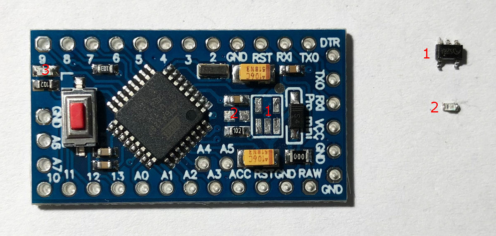
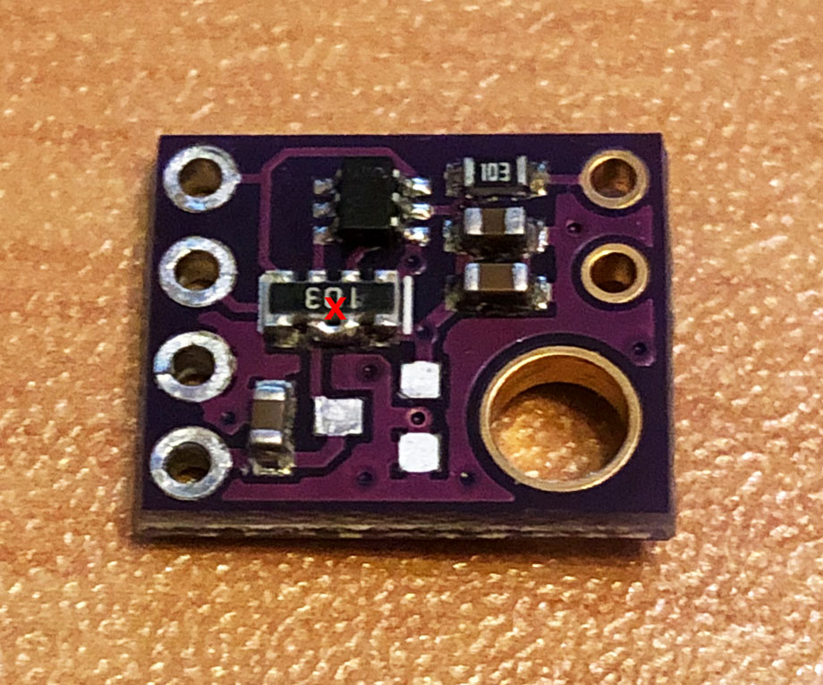
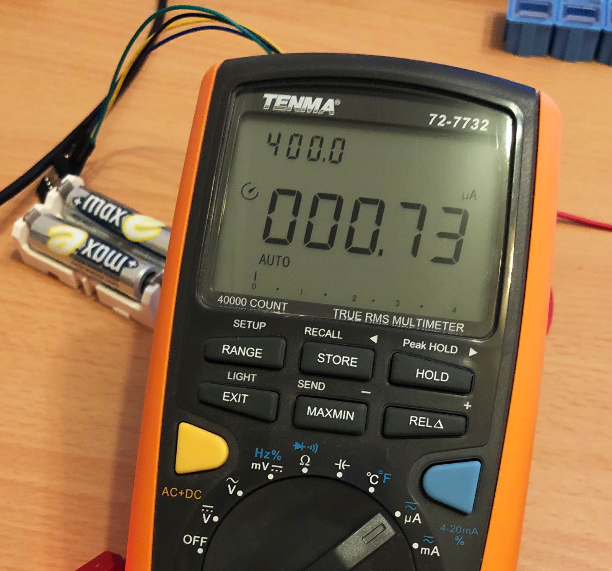
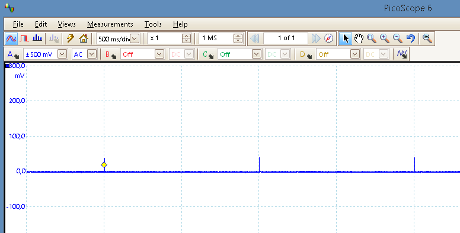
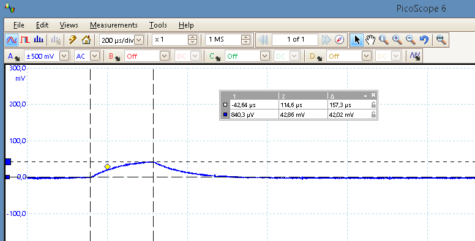

## Ruhestrom Arduino Pro Mini

- Auf dem Arduino Pro Mini sollte der LDO Spannungsregler (die Stelle ist im Bild mit 1 markiert) sowie die Power-LED (2) entfernt werden, um den Ruhestrom wesentlich zu verringern.
- Weiterhin kann die zweite LED am Arduino Pin 13 (SCK) entfernt werden (3). Deren Einfluß auf den Ruhestrom ist kleiner als bei LDO und Power-LED, trotzdem kann es sich auf lange Sicht lohnen da diese bei jeder CC1101 Kommunikation für kurze Zeit aktiv ist, besonders im BurstDetector Mode.

## Ruhestrom mit Sensor-Boards

Meine Messungen an den MAX44009 und BME280 Sensor-Boards zeigen diese Stromaufnahme im Standby:

| Sensor | Boardtyp | Strom mit LDO | Strom ohne LDO |
| --- | --- | --- | --- |
| BME280 | GYBMEP | 5 µA | 0,15 µA |
| MAX44009 | GY-49 | 6 µA | 0,7 µA |

- Der LDO (oft ist der Typ 662K zu finden) ist für den Arduino 5V Betrieb gedacht. Da die AskSinPP-Geräte mit 3,3V betrieben werden (CC1101!) ist der LDO auf den Sensor-Boards unnötig und verursacht nur erhöhten Ruhestrom. Aus diesem Grund empfehle ich diesen zu entfernen.
- Danach muss Vin mit Vout gebrückt werden. Auf den Boards ist eine I2C Level-Shifter mit 2 Transistoren und 4 Widerständen verbaut.
Das Einfachste ist es, eine kleine Lötbrücke (Vin-Vout) zwischen den 2 Widerstandspaaren zu machen, im Bild mit einem kleinem Kreuz markiert.
- Der I2C Level-Shifter funktioniert auch bei gleicher Spannung rechts und links.

Schaltung LevelShifter (Quelle: NXP Semiconductors, AN10441)

BME280 Board: Entfernung LDO und Brücke Vin-Vout

MAX44009 Board: Entfernung LDO und Brücke Vin-Vout

## Überprüfung des AVR Ruhestroms (power-down Mode)

- Der Sketch SleepTest.ino dient zur Überprüfung von Aktiv- und power-down Strom eines Arduino Pro Mini 328 - 3.3V/8MHz mit angeschlossenem CC1101 (das wäre ein Basic HM AskSinPP Gerät ohne angeschlossene Sensoren oder andere Zusatz-HW). Die Ströme sind bei batteriebetriebenen Geräten wichtig für die Batterielebensdauer.

- Der AVR wechselt mit diesem Sketch zwischen 4sec Aktiv Mode und 8sec power-down Mode (mit anschließendem Watchdog wake-up). Ein angeschlossener CC1101 kann optional ebenfalls in den Ruhezustand versetzt werden. Im aktivem Zustand wird außerdem die LED am definierten Pin eingeschaltet.

- Wenn die Fuses richtig gesetzt sind und die Hardware in Ordnung ist müssen sich die gezeigten Ströme in etwa einstellen (ca. 3mA im aktivem Zustand, **ca. 4µA im power-down Mode**). 

- Die Werte sind bei einer Batteriespannung von 2,4V gemessen. Bei 3V wird der Strom im aktivem Zustand etwas höher sein, der power-down Strom sollte sich kaum ändern.

- Multimeter haben meist einen relativ hohem Innenwiderstand im µA-Messbereich. Auf die µA-Messung sollte man deshalb nur dann kurz umschalten wenn der AVR im power-down Mode ist (LED aus) und vor Ablauf der 8sec wieder zurück auf den mA-Messbereich. Andernfalls wird der AVR im aktivem Zustand eventuell nicht wieder anlaufen, da der Spannungsabfall dann über den µA-Messbereich des Multimeters zu hoch ist.

## Überprüfung des AVR Ruhestroms (power-save Mode)

- Noch besser bezüglich Ruhestrom wird es schließlich wenn man statt dem Watchdog wake-up ein wake-up über die Timer2/RTC Option mit 32,768kHz Uhrenquarz wählt. Dieser Uhrenquarz wird an den XTAL Pins des AVR angeschlossen, als Haupttaktgeber muss man den internen 8MHz RC-Oszillator über die Fuses einstellen.

- Der zweite Sketch SleepTestRTC.ino demonstriert diese Option. Damit lassen sich **ca. 0,75uA power-save Strom** erreichen, was ein sehr gutes Ergebnis für einen Homebrew-Sensor darstellt.

## Für Interessierte

- Das wake-up Verhalten der RTC gemessen mit einem 20 Ohm Widerstand in der Versorgungsleitung. Die Stromaufnahme beträgt wie oben geschrieben ca. 0,75uA. Jede Sekunde wacht die RTC für ca. 157us Aktivzeit auf, gemessen mit dem Sketch des HB-UNI-Sensor1.

- Die zusätzliche Stromaufnahme durch dieses RTC wake-up (kann nicht mit Multimeter gemessen werden) beträgt: 
0,157ms/1000ms * 2100uA = 0,33uA

wake-up Periode

Aktivzeit

