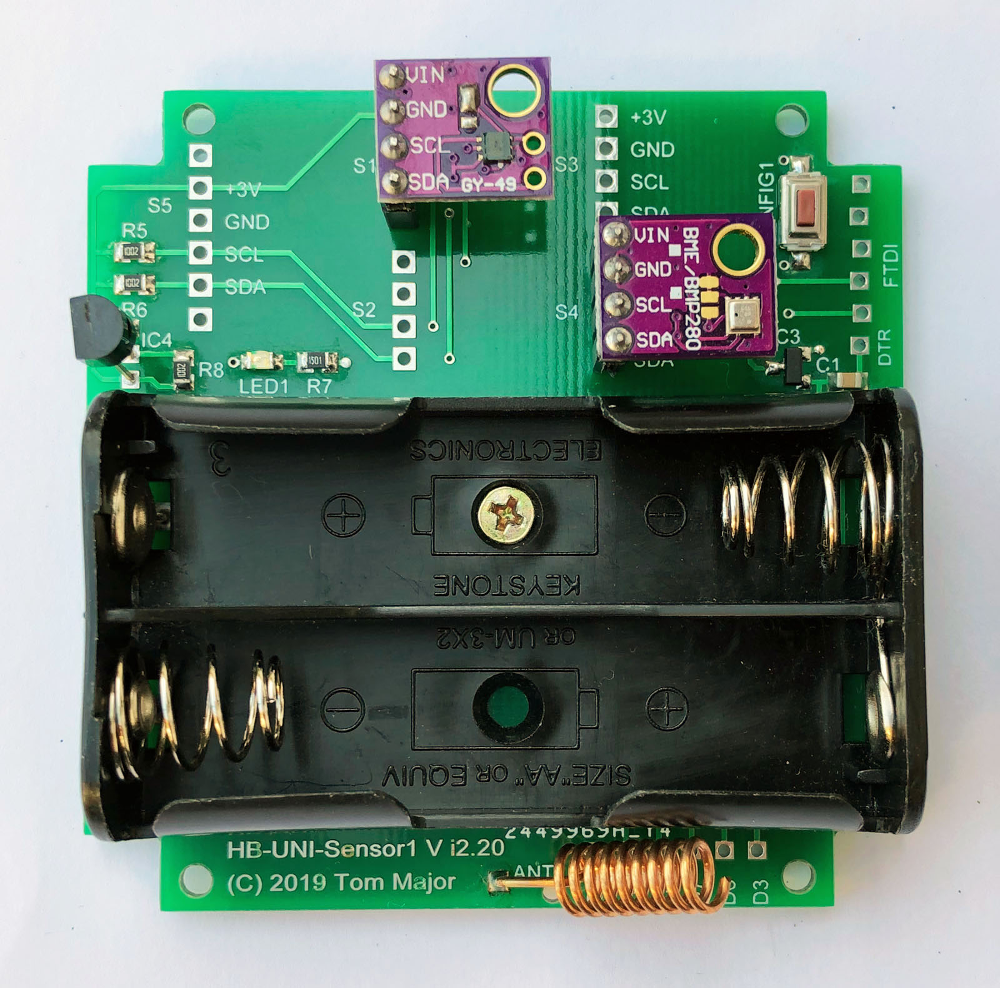
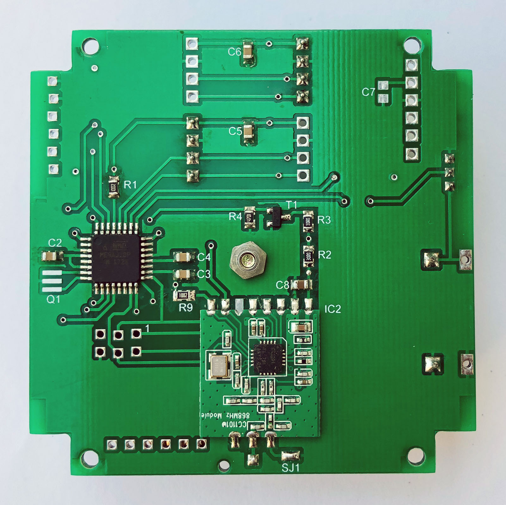

# PLHT Sensor Version i2.20

- HB-UNI-Sensor1 für für Außen- oder Innenanwendungen, 07/2019
- Weiterentwicklung vom PLHT Sensor Version 2.01 mit anderen Gehäusevarianten 

## Features

- Bestückung mit ATmega328P, RC-Oszillator als Standard
- Sensoren für Temperatur (DS18x20, BME280), Luftdruck (BME280, BMP180), Luftfeuchte (BME280, SHT10, SHT21), Helligkeit (MAX44009, TSL2561, BH1750), UV-Index (VEML6070, VEML6075) uvm. bestückbar
- 5x I2C Stiftleisten vorhanden, damit können bis zu 5 I2C Sensoren auf Breakout-Boards parallel bestückt werden
- 1-Wire Temperatursensor DS18x20 bestückbar
- Spannungsversorgung: Batterien/Akku 2 AA-Zellen
- Die nicht benutzten Arduino Pins 3, 6, 7, A0 sind auf einem extra Steckverbinder für Erweiterungen herausgeführt (K3)
- Option: Echte Batteriespannungsmessung unter Last (Schutz vor "Babbling Idiot")
- Option: uC-Supervisor MCP111 bestückbar (Schutz vor "Babbling Idiot")
- Option: Miniatur-Quarz 8MHz bestückbar (anstatt int. RC-Osc.)

## Software

[HB-UNI-Sensor1](https://github.com/TomMajor/SmartHome/tree/master/HB-UNI-Sensor1)

## Schaltung

[Sensor PLHT Vi2.20](https://github.com/TomMajor/SmartHome/tree/master/PCB/02_Sensor_PLHT_Vi2.20/Files/HB-UNI-Sensor1_Vi2.20.pdf)

## Bilder

## Bauelemente

- alle SMD Widerstände und Kondensatoren haben die Bauform 0805

- Gehäusevariante 1 (Innen): PP042W-S / BOX-SENS-WHITE
[BOX-SENS-WHITE](https://www.tme.eu/de/details/box-sens-white/gehause-fur-alarmanlagen-und-sensoren/supertronic/pp042w-s)

- Gehäusevariante 2 (Innen): 3D Druck, Design by Jan_von_neben_an (Schmelzerboy)
[Gehäuse HB-UNI-Sensor1](https://www.thingiverse.com/thing:3766944)

- Batteriehalter 2xAA: Keystone 2462

## Flashen

###### 1. Bootloader

- Zunächst wird der Arduino Standard-Bootloader mittels eines ISP-Programmers geflasht.  Beispiele für ISP-Programmer sind u.a. ~~USBasp~~, Diamex, Atmel-ICE. 
Auch ein Arduino Uno kann zum ISP-Programmer umfunktioniert werden.
- Die ISP Programmierung läuft über 6 Pins vom Steckverbinder K2.
- Achtung, K2 muss von hinten kontaktiert werden! Pin1 ist gekennzeichnet.
- Es reicht die Pins des Programmers auf K2 aufzustecken und ggf. leicht zu verkanten, die Lötpunkte sind aber schon versetzt angeordnet so dass die Pins automatisch halten sollten. Der Bootloader muss nur einmal programmiert werden.
- Für den Vorgang muss der Chip aufgelötet sein und mit Spannung versorgt werden. Falls ein externer Quarz eingesetzt werden soll muss auch dieser bestückt sein.
- Wenn der ISP-Programmer einmal dran ist sollten auch gleich die Fuses geprüft und ggf. angepasst werden (Oszillator, BOD usw.).
- Beispiele für Bootloader und Fuse-Einstellungen:
[Bootloader HB-UNI-Sensor1](https://github.com/TomMajor/SmartHome/tree/master/Info/Bootloader)

###### 2. Applikation / Sketch

- Wenn der Bootloader vorhanden ist kann ganz normal mittels eines FTDI-Adapters direkt aus der Arduino IDE seriell programmiert werden.
- Dazu wird K1 verwendet, dabei auf die richtige Reihenfolge der Pins zwischen Platine und FTDI-Adapter achten.
- Auch bei K1 sind die Lötpunkte versetzt angeordnet so dass die Pins automatisch halten sollten.

## Verbesserungen für's nächste Redesign

- die Befestigungslöcher der Platine für das BOX-SENS-WHITE Gehäuse müssen ca. 1mm weiter auseinander (TomMajor)
- das Lötpad GDO2 am CC1101 kann im Platinenlayout entfernt werden da nicht benötigt (TomMajor)
