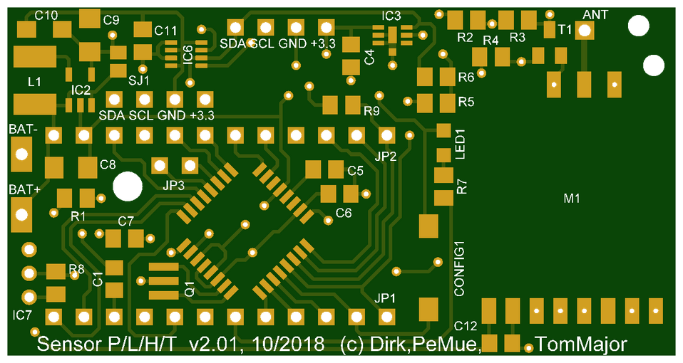

## PLHT Sensor Ver 2.01

Redesign von Dirks/PeMue's Platinen für Außen- oder Innenanwendungen, 10/2018

# Features

- Bestückung mit Arduino Pro Mini oder alternativ mit ATmega328P
- RC- oder Quarzoszillator möglich
- Sensoren für Temperatur (DS18x20, BME280), Luftdruck/Luftfeuchte (BME280), Helligkeit (MAX44009) bestückbar
- diese Sensoren können als SMD mit Reflow oder Heisßluft gelötet oder auf Breakout-Boards an den zwei I2C Stiftleisten angeschlossen werden
- andere I2C Sensoren über Breakout-Boards anschliessbar
- Spannungsversorgung: Batterien 2 Zellen / Batterie 1 Zelle mit MAX1724 / Netzteil

# Changelog Ver 2.01

- MAX44009 hinzugefügt
- BMP180 entfernt (Ersatz durch BME280)
- TSL2561 entfernt (Ersatz durch MAX44009) warum? [Vergleich TSL2561 MAX44009](https://github.com/TomMajor/AskSinPP_Examples/tree/master/Info/SensorTest_Lux)
- Zweite I2C Stiftleiste für zusätzliche Sensoren auf Breakout-Boards
- Schaltung für echte Batteriespannungsmessung unter Last hinzugefügt
- 10k pull-up Widerstand am ChipSelect des CC1101 für sicheres ISP-Flashen (Bootloader) mit verbautem CC1101
- Option: Miniatur-Quarz 8MHz bestückbar (anstatt int. RC-Osc.)
- alle Abstände der Leiterbahnen gegeneinander auf min. 0,25mm vergrößert
- Layout entflochten und verbessert
- Lötpads für BME280 und MAX44009 nach außen verlängert falls man versuchen will diese ohne Reflow oder Heisßluft zu löten

# Software

[HB-UNI-Sensor1](https://github.com/TomMajor/AskSinPP_Examples/tree/master/HB-UNI-Sensor1)

# Schaltung

[Sensor PLHT](https://github.com/TomMajor/AskSinPP_Examples/tree/master/PCB/Sensor_PLHT/Files/SensorPLHT_v201.pdf)

# Bilder

