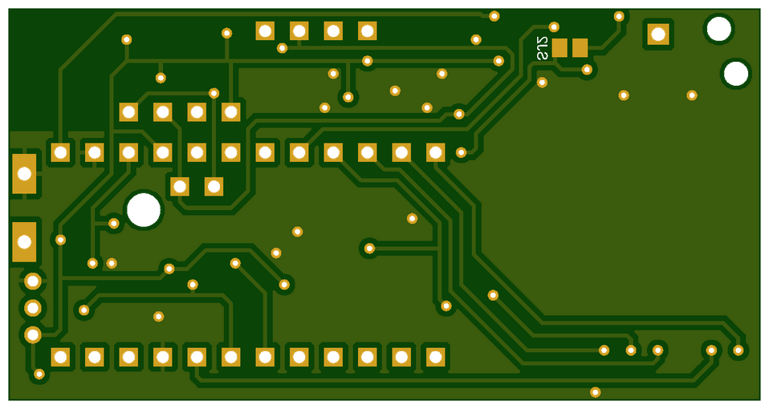

## PLHT Sensor Ver 2.01

Redesign von Dirks/PeMue's Platinen für Außen- oder Innenanwendungen, 10/2018

# Features

- Bestückung mit Arduino Pro Mini oder alternativ mit ATmega328P
- RC- oder Quarzoszillator möglich
- Sensoren für Temperatur (DS18x20, BME280), Luftdruck/Luftfeuchte (BME280), Helligkeit (MAX44009) bestückbar
- diese Sensoren können als SMD mit Reflow oder Heisßluft gelötet oder auf Breakout-Boards an den zwei I2C Stiftleisten angeschlossen werden
- andere I2C Sensoren über Breakout-Boards anschliessbar
- Spannungsversorgung: Batterien 2 Zellen / Batterie 1 Zelle mit MAX1724 / Netzteil

# Changelog Ver 2.01

- MAX44009 hinzugefügt
- BMP180 entfernt (Ersatz durch BME280)
- TSL2561 entfernt (Ersatz durch MAX44009) warum? [Vergleich TSL2561 MAX44009](https://github.com/TomMajor/AskSinPP_Examples/tree/master/Info/SensorTest_Lux)
- Zweite I2C Stiftleiste für zusätzliche Sensoren auf Breakout-Boards
- Schaltung für echte Batteriespannungsmessung unter Last hinzugefügt
- 10k pull-up Widerstand am ChipSelect des CC1101 für sicheres ISP-Flashen (Bootloader) mit verbautem CC1101
- Option: Miniatur-Quarz 8MHz bestückbar (anstatt int. RC-Osc.)
- alle Abstände der Leiterbahnen gegeneinander auf min. 0,25mm vergrößert
- Layout entflochten und verbessert
- Lötpads für BME280 und MAX44009 nach außen verlängert falls man versuchen will diese ohne Reflow oder Heisßluft zu löten

# Software

[HB-UNI-Sensor1](https://github.com/TomMajor/AskSinPP_Examples/tree/master/HB-UNI-Sensor1)

# Schaltung

[Sensor PLHT](https://github.com/TomMajor/AskSinPP_Examples/tree/master/PCB/Sensor_PLHT/Files/SensorPLHT_v201.pdf)

# Bilder

# Spezielle Bauelemente

- Gehäuse mit Klarsichtdeckel: GAINTA G201C (ohne Befestigunslaschen), GAINTA G201CMF (mit Befestigunslaschen)

- Batteriehalter 2xAA: COMF BH-321-1A

- MOSFET für Option 'Echte Batteriespannungsmessung unter Last'
    * Meine Wahl: IRML6344 (Gate Threshold Voltage 0,8V, RDSon 27mOhm, 5A, SOT-23 Gehäuse, Pinout Gate 1, Source 2, Drain 3, N-Channel)
    * Es gehen natürlich auch günstigere bzw. leichter beschaffbare MOSFETs, wichtig ist das dieser bei minimaler Betriebsspannung des Sensors (nehmen wir mal 2V an) sicher durchschalten kann (Gate Threshold Voltage) und das der RDSon möglichst klein im Bezug zu den Widerständen des Spannungsteilers R2/R3 ist.
    Und natürlich muss er den gewählten Laststrom aushalten und das Pinout muss passen.
    * Der Si2302 zum Beispiel wäre auch gut geeignet, ist leichter beschaffbar und günstiger (aliexpress), Gate Threshold Voltage 0,7V, RDSon 85mOhm, 2,6A.

- Spule für optionalen Step-Up Wandler: Murata LQH43CN100K03L oder vergleichbare, unbedingt Strom und DC-Widerstand beachten, aus Produktrange 'Power lines', 'DC/DC' o.ä.

# Bestückungsvarianten

| Thema | Variante | zu bestückende Bauelemente |
| --- | --- | --- |
| CC1101 | immer | M1, R9, C12 |
| Interface | immer | LED1, R7, CONFIG1 |
| I2C | immer | R5, R6 |
| CPU | ATmega328P Chip | IC1, R1, C1, C5, C6, C7 |
| CPU | Arduino Pro Mini | über Pin Header JP1, JP2, JP3 stecken oder löten |
| I2C Sensoren | Temperatur, Luftdruck, Luftfeuchte, Helligkeit | nach Bedarf IC3 + C4, IC6 + C11, SV1, SV2 |
| 1-Wire Sensor DS18B20 | Temperatur | IC7, R8 |
| Betriebsspannung | Standard 2x AA (3V) | SJ1 geschlossen |
| Betriebsspannung | Step-Up 1x AA oder Akku (1,2-1,5V) | MAX1724, L1, C8, C9, C10, SJ1 offen |
| Betriebsspannung | >3V | nur mit LDO, extern oder LDO auf dem Arduino Pro Mini, SJ1 offen |
| Messung Batteriespannung | Standard 3V | keine zusätzlichen Bauelemente nötig |
| Messung Batteriespannung | Step-Up MAX1724 | R2 470k, R3 100k, SJ2 geschlossen |
| Messung Batteriespannung | Messung unter Last (Schutz vor "Babbling Idiot") | R2 30, R3 10, T1, R4 bestücken, SJ2 offen, R2/R3 an gewünschten Laststrom anpassen |

# Flashen

**Thema in Arbeit**

# Verbesserungen für's nächste Redesign

- das linke Bohrloch D2,5mm besser zu den vorhandenen Löchern im Batteriehalter ausrichten, zweites Bohrloch rechts vorsehen (TomMajor)
- Arduino Pro Mini Leiste JP2/U-Bat: Jumper vorsehen um beim Pro Mini den Eingang des LDO abzuklemmen, der LDO wird bei Batteriebetrieb nicht benötigt. Am Besten ist es sowieso den LDO zu entfernen um Ruhestrom zu sparen. (TomMajor)
- MAX44001 und BME280 Pin 1 Markierungen nachtragen (PeMue)
- SHT10 optional (kpwg)
- die Breakout-Boards Pinreihen beide am Rand platzieren und mit Abstand zueinander - aktuell musste ich am MAX44009 feilen, damit es passte (kpwg)
- alle wichtigen Beschriftungen des Bestückungsdruckes größer machen - die Chinesen haben offenbar Probleme mit so kleinen Zeichen (kpwg)
- die LED Pads als 1206 vorsehen - 0805 lässt sich auf 1206 gut auflöten, aber 1206 auf 0805 ist schon grenzwertig (kpwg)
- ich verfolge etwas die Diskussion über GND bei der Antennen des CC1101. Um da flexibler zu sein (also eventuell die Durchkontaktierung aufbohren zum Trennen) ist es eventuell besser, sich das GND für den T1 aus einer getrennten Durchkontaktierung und nicht aus dem linken GND des CC1101 zu holen. (harvey)
- ISP-Header zum bequemen initialen Prog. des Bootloaders - noch unklar ob im Layout machbar (TomMajor, kpwg)
