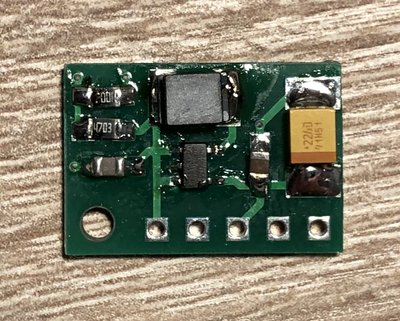
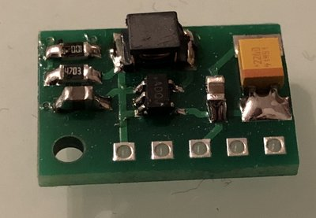

# StepUp-Board MAX1724

- Ein kleines Board für den Step-Up Wandler MAX1724.

- Entstanden in Zusammenarbeit mit Jerome (jp112sdl) um vorhandene HomeBrew AskSinPP-Projekte auf die Versorgung mit einer Zelle umzustellen. 
  Ich habe mich vor einiger Zeit etwas mit dem korrekten Layouten für DC/DC-Wandler Applikationen beschäftigt. :biohazard:

- Eingangspannung NiMH 1,2V oder Alkaline 1,5V, Ausgangsspannung 3V bzw. 3,3V.

- Der Spannungsteiler 100k/470k für die AskSinPP Batteriespannungsmessung *BatterySensorUni* kann optional bestückt werden.

## Bilder

## Schaltplan

[:arrow_right: StepUp-Board MAX1724](https://github.com/TomMajor/SmartHome/tree/master/PCB/StepUp_Board_MAX1724/Files/StepUp_Board_MAX1724.pdf)

## Platine

[:arrow_right: PCB Gerber](Gerber)

## Aufbau / Stückliste

| Anzahl	| Name	    | Wert	            | Gehäuse       | Bemerkungen |
|---|---|---|---|---|
| 2 | C1, C2 | 10µ            | 0805	| |
| 2 | C3   | 22µ              | Bauform B oder C | Tantalelko |
| 1 | L1   | 10µ              | - | LQH43CN100K03L |
| 1 | IC1  | MAX1724EZK30     | SOT23-5 | auch MAX1724EZK33 möglich |
| 1 | R1   | 100k             | 0805	| optional, für AskSinPP Batteriespannungsmessung |
| 1 | R2   | 470k             | 0805	| optional, für AskSinPP Batteriespannungsmessung |

- Ob man für AskSinPP Geräte beim MAX1724 die 3,0V oder die 3,3V Version verwendet (bzw. beschaffen kann :crying_cat_face:) wäre für mich gleichwertig. 
Ich würde bei der 3,3V Version auf einen **geringen** erhöhten Stromverbrauch wegen der höheren Vout-Vin Differenz tippen, aber anderseits steigt der Wirkungsgrad mit erhöhter Vout, siehe Diagramme im Datenblatt. 
Insofern ist der Unterschied im Stromverbrauch nur eine Vermutung bis man nicht selber vergleichsweise gemessen hat (und das ist nicht ganz einfach wegen dem discontinuous PFM control scheme des MAX1724). 
In der Praxis spielt der Unterschied vermutlich keine Rolle.

###### Hinweise zur Beschaffung LQH43CN100K03L und MAX1724

- [Conrad](https://www.conrad.de), [TME](https://www.tme.eu/de), [RS privat](https://www.rsonline-privat.de), [Mouser](https://www.mouser.de) - **alle auch für Privatkunden**
- [Farnell](https://de.farnell.com) - **nur gewerbliche Kunden**
- Bei Farnell finde ich die parametrische Suche genial, z.B. 
"*liste mir alle P-Kanal Mosfet im SOT-23 Gehäuse mit einer Ugs von >= 20V und sortiere sie aufsteigend nach ihrem Rdson-Widerstand.*"
- Mouser macht nach meinen Erfahrungen nur Spaß wenn man über den Mindestbestellwert von ca. 50€ kommt, sonst fallen hohe Versand-/Zollkosten an.
- Farnell und Mouser versenden wahnsinning schnell, ist teilweise am nächsten Tag bereits da.

###### :exclamation: MAX1724: Warnung vor Fakes bei Ali

Bei einem Supportfall für den HB-UNI-Sensor1 im FHEM Forum für user *vbs* stellte sich heraus, das er "minderwertige" bzw. gefakte MAX1724 von Ali bekommen hatte. 
Die hatten im Leerlauf erst mal unauffällig ihre 3,3V erzeugt, aber sobald es ans Senden ging brach die Spannung ein (bei Vin 2,5V oder kleiner). 
Danach hat er bei RS in DE bestellt und alles bestens.  
Es sind auch Unterschiede bei der Beschriftung zu sehen, alle Details zum Thema hier: 
[Fehlerhafte MAX1724 Bausteine](https://forum.fhem.de/index.php/topic,100165.0.html)  
Nach den Messungen von user *vbs* im Thread [Selbstbau HM_WDS10_TH_O mit Luftdruckmessung](https://forum.fhem.de/index.php/topic,20620.msg930511.html#msg930511) müsste das als Test reichen um die Fakes zu identifizieren: 
MAX1724 mit Vout = 3,3V, Vin = 2,5V, Rlast = 48 Ohm, beim Fake-Chip bricht da Vout ein, für den Original-Chip kein Problem. 

<figure>
  
  <figcaption>MAX1724 Original (direkt von Maxim), 3,0V Version (Markierung ADQI)</figcaption>
</figure>
 
<figure>
  
  <figcaption>MAX1724 Good-Bad, 3,3V Version (Markierung ADQJ), Quelle: FHEM user vbs</figcaption>
</figure>

## Lizenz

**Creative Commons BY-NC-SA** 
Give Credit, NonCommercial, ShareAlike

 This work is licensed under a <a rel="license" href="http://creativecommons.org/licenses/by-nc-sa/4.0/">Creative Commons Attribution-NonCommercial-ShareAlike 4.0 International License</a>.
