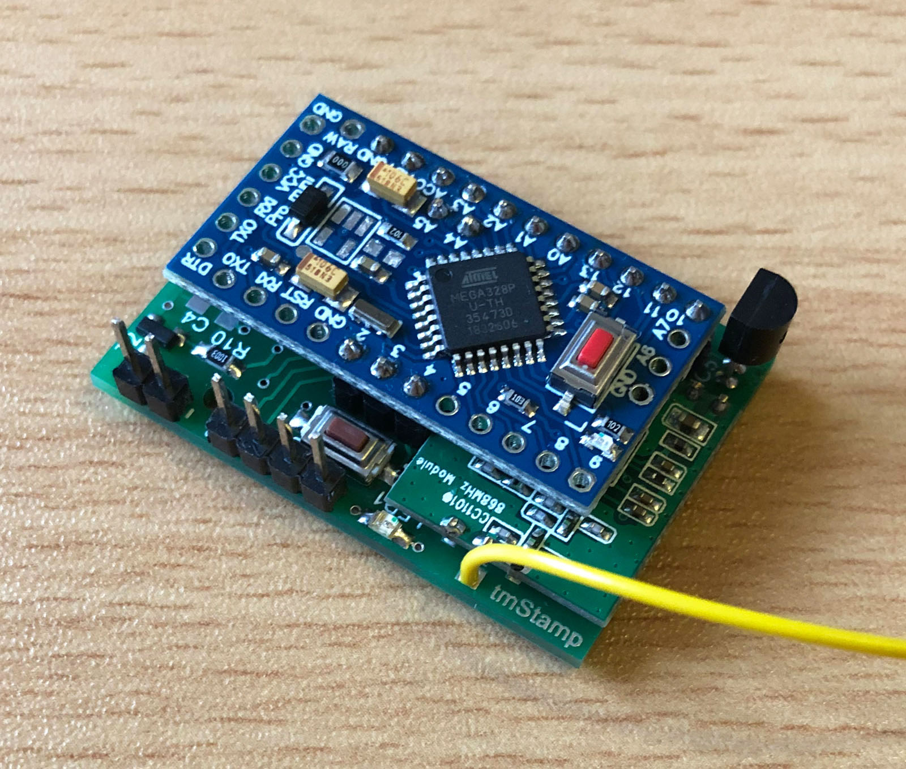
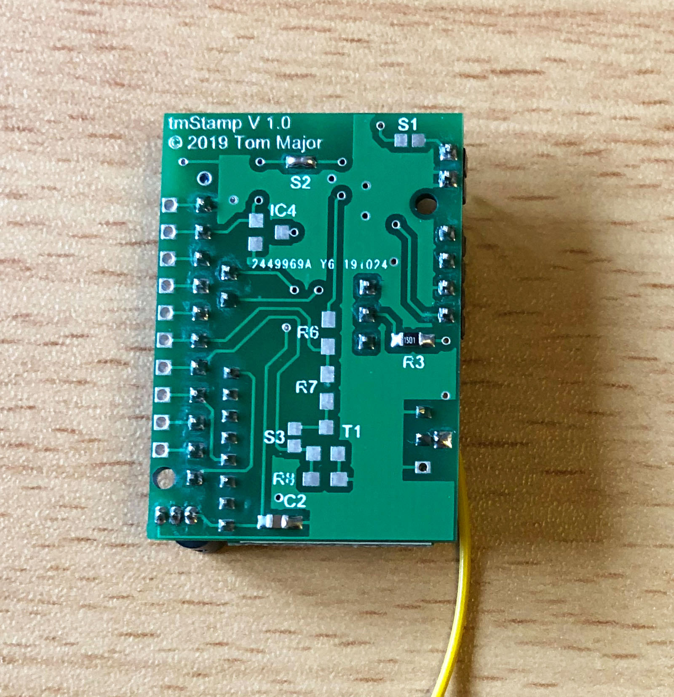
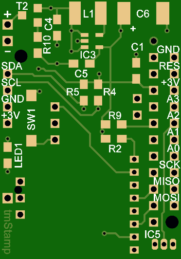
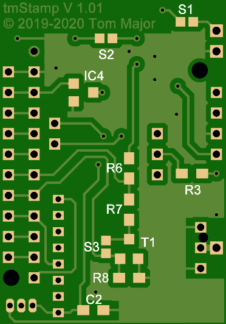
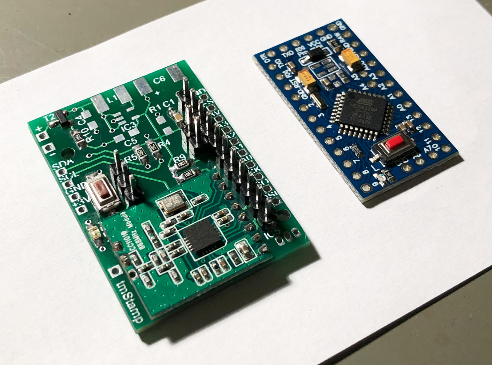
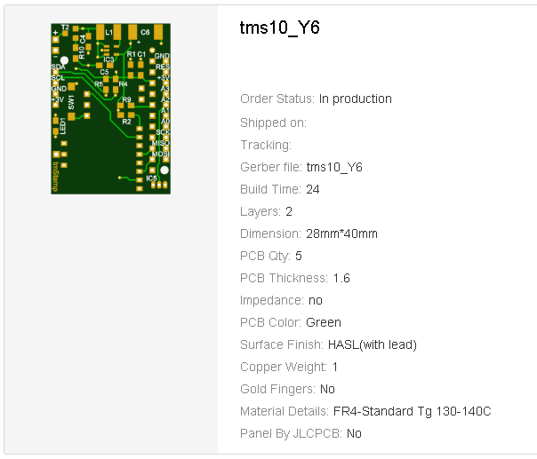

# tmStamp - kleine AskSinPP Universalplatine basierend auf Arduino Pro Mini

Im Oktober des Jahres 2019 verspürte ich das Verlangen nach einer kleinen AskSinPP Universalplatine, um mal eben schnell ein HomeMatic-Gerät aufbauen zu können **und** nicht jedesmal den ATmega328P als SMD TQFP32 löten zu müssen. 
Es gibt ja bereits einige Platinen dieser Art auf dem "Markt", aber einige davon sind nicht Open Source :crying_cat_face: und die anderen hatten nicht die zusätzlichen Optionen die ich im Sinn hatte. 
Herausgekommen ist dabei die *tmStamp*.

Features:

- Einsatz eines Arduino Pro Mini um nicht immer den ATmega328P als SMD TQFP32 löten zu müssen
- Es wurde ein Kompromiss angestrebt zwischen einerseits minimalen Abmessungen (Pro Mini und CC1101 als Stack übereinander) und andererseits zusätzlichen Optionen um das Board möglichst universell einsetzen zu können
- CC1101, Config-Taster und LED natürlich On-Board
- Die folgenden zusätzlichen Optionen existieren, alle nur *bei Bedarf* bestückbar:
  - Verpolschutz
  - StepUp-Wandler MAX1724 zur Versorgung aus einer Zelle
  - Echte Batteriespannungsmessung unter Last
  - Optionaler Reset-Baustein MCP111 (Schutz vor "Babbling Idiot")
  - DS18B20 Temperatursensor On-Board
  - vollständiger I2C-Anschluß mit Power-Pins zum schnellen Anschluß von Sensor Breakout-Boards wie BME280 usw.
  - I2C pull-up Widerstände
  - Zugang zu den SPI-Pins SCK/MOSI/MISO über extra Lötpads (rechten Seite)
  - Zugang zu den Analog-Pins A0..A3 über extra Lötpads (rechten Seite)
  - Zugang zu den frei verwendbaren Digital-Pins D5..D9 direkt am Arduino Pro Mini (linken Seite)

## Bilder

## Schaltplan

[:arrow_right: tmStamp V1.00](https://github.com/TomMajor/SmartHome/tree/master/PCB/tmStamp/Files/tmStamp_v100.pdf)

[:arrow_right: tmStamp V1.01](https://github.com/TomMajor/SmartHome/tree/master/PCB/tmStamp/Files/tmStamp_v101.pdf)

## Platine

[:arrow_right: PCB Gerber](Gerber)

## Aufbau / Stückliste

| Anzahl    | Name      | Wert              | Gehäuse       | Bemerkungen |
|---|---|---|---|---|
| 1 | R2                | 10k               | 0805          | |
| 1 | R3                | 1,5k              | 0805          | |
| 1 | C1                | 100n              | 0805          | |
| 1 | C2                | 1µ                | 0805          | |
| 1 | SW1               | DTSM-3            | SMD           | |
| 1 | LED1	            | gelb	            | 0805          | |
| 1 | IC1	            | Arduino Pro Mini  | -             | 3,3V / 8MHz Version |
| 1 | IC2	            | CC1101	        | -             | |
| 1 | ANT1	            | 868 MHz Antenne   | -             | z.B. Drahtstück 86mm lang |
|   |                   |                   |               | |
| 2 | R4, R5            | 10k               | 0805          | Optional (I2C pull-up Widerstände) |
|   |                   |                   |               | |
| 1 | R10               | 100k              | 0805          | Optional (Verpolschutz) |
| 1 | T2                | DMG3415U          | SOT23-3       | Optional (Verpolschutz) |
|   |                   |                   |               | |
| 1 | L1	            | 10µ -> LQH43CN100K03L | SMD       | Optional (StepUp-Wandler zur Versorgung aus einer Zelle) |
| 2 | C4, C5	        | 10µ	            | 0805          | Optional (StepUp-Wandler zur Versorgung aus einer Zelle) |
| 1 | C6	            | 22µ/16V           | ELKO_C        | Optional (StepUp-Wandler zur Versorgung aus einer Zelle) |
| 1 | IC3	            | MAX1724EZK30 oder MAX1724EZK33 | SOT23-5 | Optional (StepUp-Wandler zur Versorgung aus einer Zelle) |
|   |                   |                   |               | |
| 1 | R6	            | 30	            | 0805          | Optional (Echte Batt.messung unter Last) |
| 1 | R7	            | 10	            | 0805          | Optional (Echte Batt.messung unter Last) |
| 1 | R8	            | 4,7k	            | 0805          | Optional (Echte Batt.messung unter Last) |
| 1 | T1	            | IRLML6344         | SOT23-3       | Optional (Echte Batt.messung unter Last) |
|   |                   |                   |               | |
| 1 | IC4	            | MCP111T-240	    | SOT23-3       | Optional (BI-Protection) |
|   |                   |                   |               | |
| 1 | R9	            | 10k	            | TO92          | Optional (Temperaturmessung) |
| 1 | IC5	            | DS18B20	        | TO92          | Optional (Temperaturmessung) |

**Achtung: Wenn der DC-DC/StepUp Wandler MAX1724 nicht benutzt wird muss S2 gebrückt werden!**

WIP: Bemerkung über Länge der Pfostenleiste.

## Verbesserungen für's nächste Redesign

###### Version 1.00

- R1 entfernen 
R1 war als der Standard pull-up Widerstand für die Resetleitung des AVR vorgesehen. 
Da der Arduino Pro Mini den bereits On-Board hat braucht er nicht bestückt werden.
- Die 3 Pad-Löcher auf der Antennenseite des CC1101 haben im Gegensatz zur SPI-Seite ein 2,54mm Raster (die SPI-Seite hat 2mm) - dies wurde beachtet. 
Allerdings habe ich dort den gleichen Bohrlochdurchmesser von 0,7mm wie für die SPI-Seite verwendet. Dadurch passen nur die Pins eines 2mm Pfostensteckers, nicht die eines 2,54mm Pfostensteckers. Eventuell diese 3 Löcher auf 0,9mm vergrößern.

###### Version 1.01

- Beide Verbesserungen aus V1.00 wurden gemacht.
- Züsätzlich ein Loch in Nähe des CC1101 Antennenpads gesetzt um bei Bedarf auch einen Draht von unten direkt in das Antennenpad einlöten zu können. 
Die Antenne direkt von oben in das CC1101-Modul einzulöten geht natürlich auch.

## Lizenz

**Creative Commons BY-NC-SA** 
Give Credit, NonCommercial, ShareAlike

 This work is licensed under a <a rel="license" href="http://creativecommons.org/licenses/by-nc-sa/4.0/">Creative Commons Attribution-NonCommercial-ShareAlike 4.0 International License</a>.
